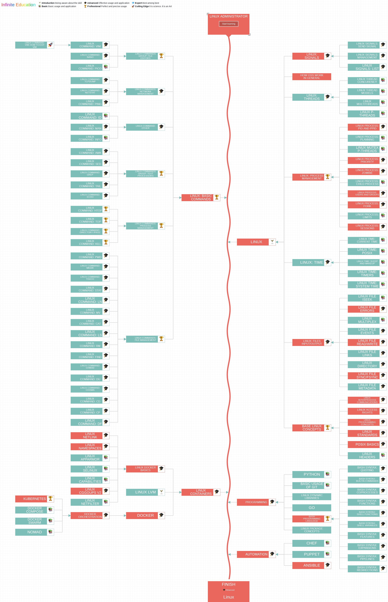

# Linux1400140

#### Description

[[1400140]Linux操作系统](https://gitee.com/lkljty/Linux1400140)

#### Lecture

| 章节                           | 链接                                                 |
| ------------------------------ | ---------------------------------------------------- |
| 课程介绍                       | [课程介绍](./lecture/Intro.md)                       |
| Linux系统概述                  | [Linux系统概述](./lecture/Overview.md)               |
| Linux系统安装与基本使用        | [Linux系统安装与基本使用](./lecture/Installation.md) |
| Linux文件系统及命令（1）       | [Linux文件系统及命令（1）](./lecture/cmd1.md)        |
| Linux文件系统及命令（2）       | [Linux文件系统及命令（2）](./lecture/cmd2.md)        |
| Vim编辑器                      | [Vim](./lecture/Vim.md)                              |
| Linux网络管理及服务（1）       | [Linux网络管理及服务（1）](./lecture/Service1.md)    |
| Linux网络管理及服务（2）       | [Linux网络管理及服务（2）](./lecture/Service2.md)    |
| Linux系统管理基础（1）         | [Linux系统管理基础（1）](./lecture/Mgmt1.md)         |
| Linux系统管理基础（2）         | [Linux系统管理基础（2）](./lecture/Mgmt2.md)         |
| LinuxC编程基础（1） --gcc、gdb | [LinuxC编程基础（1） --gcc、gdb](./lecture/C1.md)    |
| LinuxC编程基础（2） --make     | [LinuxC编程基础（2） --make](./lecture/C2.md)        |
| LinuxC编程基础（3） --系统调用 | [LinuxC编程基础（3） --系统调用](./lecture/C3.md)    |
| Shell编程（1）                 | [Shell编程（1）](./lecture/Shell1.md)                |
| Shell编程（2）                 | [Shell编程（2）](./lecture/Shell2.md)                |
| Linux内核与应用                |                                                      |

#### Lab

| 实验                             | 链接                      |
| -------------------------------- | ------------------------- |
| Lab1**Linux安装及环境基本使用**  | [Lab1](./lab/lab1.md)     |
| Lab2**Linux文件系统及命令（1）** | [Lab2](./lab/lab2.md)     |
| Lab3**Linux文件系统及命令（2）** | [Lab3](./lab/lab3.md)     |
| Lab4**Vim编辑器**                | [Lab4](./lab/lab4.md)     |
| Lab5+6**网络管理及服务**         | [Lab5+6](./lab/lab5+6.md) |
| Lab7**linuxC编程基础（1）**      | [Lab7](./lab/lab7.md)     |
| Lab8**linuxC编程基础（2）**      | [Lab8](./lab/lab8.md)     |
| Lab9**Shell编程**                | [Lab9](./lab/lab9.md)     |
| Lab10**系统管理基础**            | [Lab10](./lab/lab10.md)   |

https://www.linuxprobe.com/linux-mind-it.html

#### Project

[Project](./project/project.md)

#### FAQ

[FAQ](./FAQ/FAQ.md)