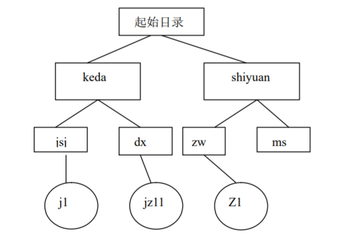

## Lab2 **Linux文件系统及命令（1）**  

实验目的：

1. 熟悉 Linux 图像化和终端界面操作； 
2. 能够在文本界面基于命令对文件系统操作。

实验要求：

1. 掌握图形化用户界面和字符界面下使用 Shell 命令的方法。
2. 掌握建立文件、查看文件、文件内查找、文件查找、文件压缩打包、目 录操作、权限修改等 Shell 命令的功能。  

实验内容：

## shell 命令

1. 使用 Shell 命令，显示系统时间，并将系统时间修改为 2010 年 12 月 12 日零 点。
2.  将系统日期和时间修改为当前值。
3. 查看 2010 年 12 月 12 日是星期几。
4. 查看 ls 命令中的-s 选项的帮助信息。

## 文件操作

1. 用 mkdir 命令在你的起始目录下建立一个如图所示的目录结构，建立好 后，完成下列功能：

   - 在 jsj 子目录下，利用 cat 命令建立个名为 j1 的文本文件（内容自定）；
   - 再利用 cat 目录在 zw 子目录下建立一个名为 z1 的文本文件； 
   - 将 j1 与 z1 合并后，放入子目录 dx 下形成 jz11 文件（在这里请注意各文 件的路径名）合并后，用 cat 命令显示 jz11 文件的内容，以此验证结果的正确性。
   
   
   
6. 用 cat 命令在起始目录下建一个多行（大于一屏）文件，然后用 less 命令逐 页显示其内容。（文件名自定），用 h 子命令显示子命令名表。

## 练习课堂所列出的命令

