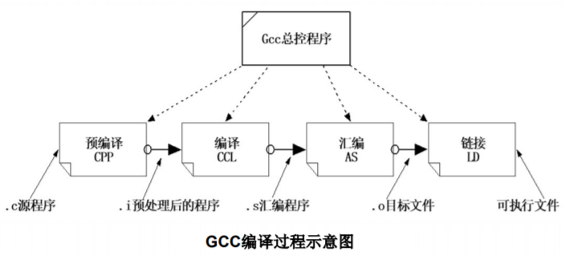
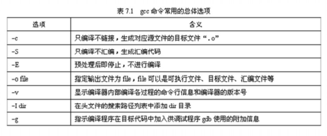
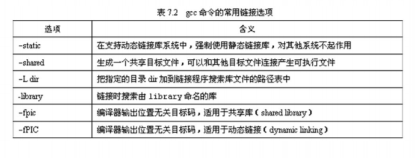

# Linux C编程基础（1） --gcc、gdb

在Linux下进行C语言编程

- 首先要选择编辑器， 自带的编辑器为vim
- 然后要选择编译器，常用的是GNU C/C++编译器 GCC或者LLVM的clang
- 接下来选择调试器，应用最广泛的调试器是GDB
- 同时还可以利用程序维护工具进行程序维护，make是Linux 下较常用的程序维护工具

Linux内核中设置了一组用于实现各种系统功能的子程序，称为系统调用（API）

用户可以通过系统调用命令在自己的应用程序中调用它们，从某种角度来看，系统调用和普通的函数调用非常相似

区别仅仅在于，系统调用由操作系统核心提供，运行于核心态；而普通的函数调用由函数库或用户自己提供，运行于用 户态

随Linux核心还提供了一些C语言函数库，这些库对系统调用 进行了一些包装和扩展，因为这些库函数与系统调用的关系 非常紧密，所以习惯上把这些函数也称为系统调用


## GCC

目前Linux下最常用的C语言编译器是GCC（GNUCompiler Collection），它是Linux平台编译器的事实标准

GCC是GNU项目中符合ANSI C标准的编译系统，能够编译用C、C++和Object C等语言编写的程序

GCC之所以被广泛采用，还因为它能支持各种不同的目标体系结构。目前，GCC支持的体系结构有四十余种，常见的有X86系列、ARM、PowerPC等。同时，GCC还能运行在不同的操作系统上，如
Linux、Solaris、Windows等

使用GCC编译程序时，编译过程可以被细分为四个阶段

1. 预处理（Pre-Processing）
2. 编译（Compiling）
3. 汇编（Assembling）
4. 链接（Linking）

在这四个阶段中可以设置选项分别生成扩展名分别为“.i”、“.s”、“.o”的文件，以及最终可执行文件，各扩展名文件含义如下

- .c：最初的c源代码文件。

- .i：经过编译预处理的源代码。 

- .s：汇编处理后的汇编代码。

- .o：编译后的目标文件，含有最终编译出的机器码，但它 里面所引用的其他文件中函数的内存位置尚未定义



下面以程序hello.c为例具体看一下GCC是如何完成以上四个步
骤的，程序hello.c源代码如下所示

```c
#include <stdio.h>

int main(void) {
    printf("Hello World!\n");
    return 0;
}
```

### 预处理阶段

在该阶段，编译器将上述代码中的stdio.h编译进来。GCC首 先调用cpp进行预处理，根据以字符#开头的命令修改原始的 C程序

如hello.c中的指令#include告诉预处理器读系统头文件stdio.h的内容，并把它直接插入到程序文本中去，结果就得到经过编译预处理的源代码hello.i

```shell
gcc -E hello.c -o hello.i
```

### 编译阶段

GCC调用ccl检查代码的规范性，是否有语法错误等，以确 定代码实际要做的工作，在检查无误后，把代码翻译成汇编语言， 生成汇编处理后的汇编代码hello.s。这个阶段对应的GCC命令 如下所示

```shell
gcc -S hello.i -o hello.s
```

### 汇编阶段

GCC调用as把编译阶段生成的hello.s文件转成编译后的目标文件hello.o，但hello.c中所引用的其他文件中函数（如printf） 的内存位置尚未定义。这个阶段对应的GCC命令如下所示

```shell
gcc -c hello.s -o hello.o
```

### 链接阶段

GCC调用ld将程序的目标文件与所需的所有附加的目标文件 连接起来，最终生成可执行文件。如GCC找到hello.c所调用的 函数printf函数库所在位置/user/lib，把函数的实现链接进来， 生成最终的可执行文件hello，可以利用下面的命令完成

```shell
gcc hello.o -o hello
```

### GCC的使用

格式: gcc [选项|文件]

#### 总体选项



#### 链接选项



#### 警告选项


1. 编译当前目录下的文件helloworld.c

   ```shell
   gcc helloworld.c
   ```

   该命令将helloworld.c文件预处理、汇编、编译并链接形成可执 行文件。这里未指定输出文件，默认输出为a.out，a.out为可执 行程序文件名

2. 将当前目录下的文件helloworld.c编译成名为helloworld 的可执行文件

   ```shell
   gcc –o helloworld helloworld.c
   ```

3. 将当前目录下的文件helloworld.c编译为汇编语言文件

   ```sh
   gcc –S helloworld.c
   ```

   该命令生成helloworld.c的汇编文件helloworld.s，使用的是 AT&T汇编

4. 将文件testfun.c 和文件test.c 编译成目标文件test

   1. 方法1

      ```shell
      gcc testfun.c test.c -o test
      ```

   2. 方法2

      ```shell
      gcc -c testfun.c
      ```
      
      将testfun.c编译成testfun.o

      ```shell
      gcc -c test.c
      ```

      将test.c编译成test.o
      
      ```shell
      gcc testfun.o test.o -o test
      ```
      
      将testfun.o和test.o链接 成test

5. 编译当前目录下的程序bad.c，同时查看编译过程中所有报警信息

   程序bad.c的源码如下所示

   ```c
   #include <stdio.h>
   
   int main(void) {
       printf ("Two plus two is %f\n", 4); 
       return 0;
   }
   ```

   编译并运行

   该程序例中，对整数值来说，正确的格式控制符应该是%d。 如果 不启用 -Wall，程序表面看起来编译正常，但是会产生不正 确的结果

### 练习

#### 例一

编写程序将a、b、c三个字符压入堆栈，然后 依次从堆栈中弹出三个字符并打印在屏幕上

stack.c和main.c

将两文件编译链接成可执行文件main并运行

```shell
gcc main.c stack.c -o main
```

#### 例二

编写程序将a、b、c三个字符压入堆栈，然 后从堆栈中依次弹出三个字符并打印在屏幕上。注： 利用头文件的形式

stack.c，stack.h和main.c

编译成目标文件

因stack.h和main.c在同一个目录下，则用如下命令 编译并运行

```shell
gcc -c stack.c
```

```shell
gcc -c main.c
```

```shell
gcc -o main main.o stack.o
```

如stack.h不在当前目录，则要指定目录。如 stack.h在目录/home/user下，则用如下命令编译 并运行

```shell
gcc -o main main.o stack.o -I/home/user
```

#### 例三

编写程序将a、b、c三个字符压入堆栈，然后从堆栈中 依次弹出三个字符并打印在屏幕上。注：利用静态链接库

制作库文件libstack.a

1. 生成stack.c文件的目标文件stack.o

   ```shell
   gcc -c stack.c
   ```

2. 用ar命令归档，生成文件libstack.a（归档文件名一 定要以lib打头, .a结尾）。格式为ar -rc <生成的档案文件名 > <.o文件名列表>

   ```shell
   ar -rc libstack.a stack.o
   ```

3. 编译源文件main.c为目标文件main.o，注意要把静态库 头文件的路径加到-I参数里面

   ```shell
   gcc -I /home/user -o main.o -c main.c
   ```

4. 生成可执行文件，注意要把静态库文件的路径加到-L参 数里面，把库文件名（去掉打头的lib和结尾的.a)加到-l参数 后面

   ```shell
   gcc -o main -L /home/user main.o -lstack
   ```

5. 运行可执行文件

   ```shell
   ./main
   ```

## GDB

程序中的错误通常分为以下三类

1. 编译时错误
   又称为语法错误，主要是程序代码中有不符合所用编程 语言语法规则的错误，如使用未定义的变量，括号不成对等

2. 运行时错误

   编译器检查不出这类错误，仍然可以生成可执行文件， 但在运行时会出错而导致程序崩溃。如除数为0，死循环等

3. 逻辑错误和语义错误

gdb是Linux系统中一个功能强大的GNU调试程序，它可以调试 C和C++程序，使程序开发者在程序运行时观察程序的内部结构和内存的使用情况

gdb提供如下功能

1. 运行程序，设置所有的能影响程序运行的参数和环境。
2. 控制程序在指定的条件下停止运行。
3. 当程序停止时，可以检查程序的状态。
4. 修改程序的错误，并重新运行程序。
5. 动态监视程序中变量的值。
6. 可以单步逐行执行代码，观察程序的运行状态。
7. 分析崩溃程序产生的core文件。

### 启动GDB

要使用gdb调试程序，首先在编译时，必须把调试信息加到可执行文件中， 可通过使用编译器gcc的 -g 参数完成

```shell
gcc -g hello.c -o hello
```

启动gdb的方法有以下四种：

