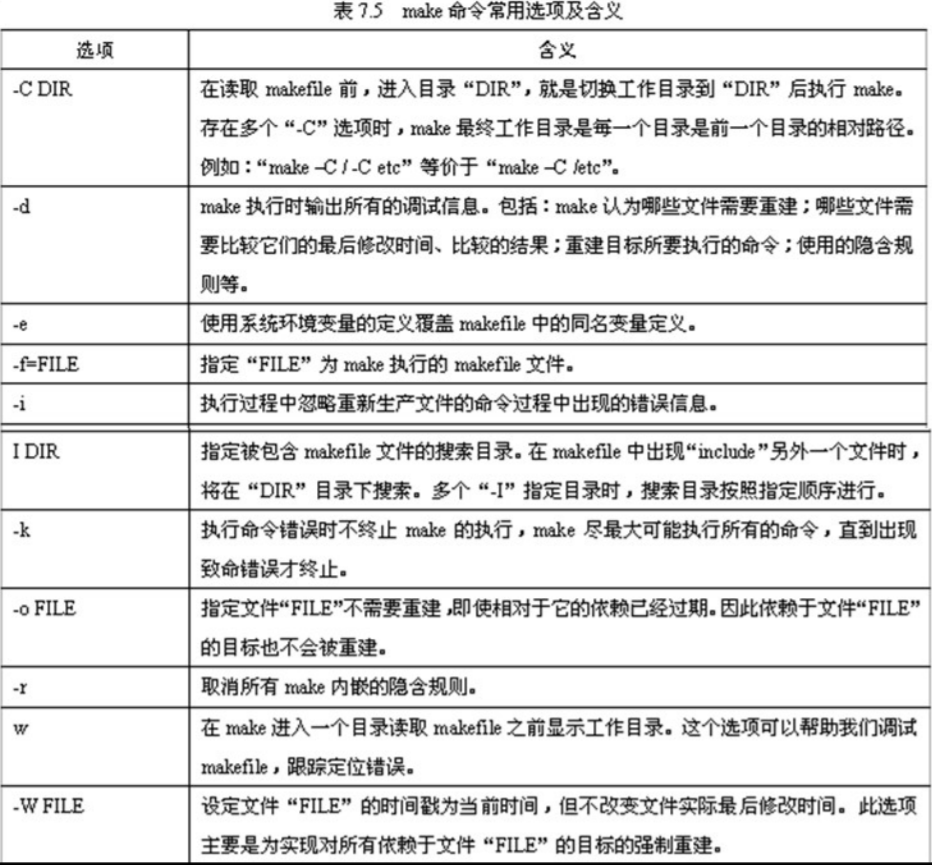
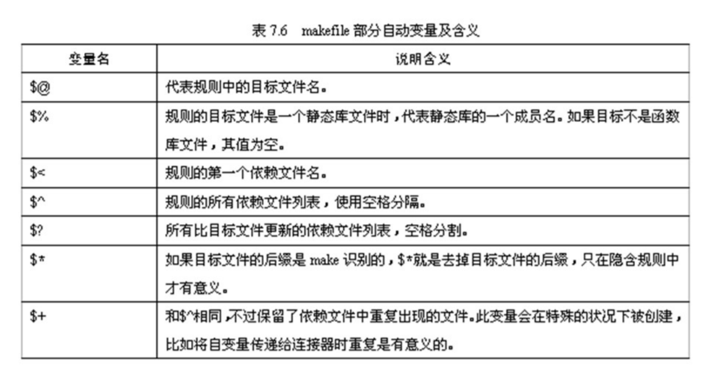

# Linux C编程基础（2） --make

## Make的工作机制

Make是一个控制计算机程序从代码源文件到可执行文件或其他 非源文件生成过程的工具。控制命令通过称为makefile的文件传 递给make工具。makefile记录了如何生成可执行文件等命令。 make也可以检测大型程序的哪一部分需要重新编译，然后发出 命令重新编译（节省编译时间）。GNU的make的工作过程如下

1. 读入makefile文件
2. 初始化文件中的变量
3. 推导隐式规则，并分析所有规则
4. 为所有目标文件创建依赖关系链
5. 根据依赖关系和时间数据，确定哪些文件需要重新生成
6. 执行相应生成命令

## makefile文件

要用make维护一个程序，必须创建一个makefile文 件，makefile文件告诉make以何种方式编译源代码 和链接程序。makefile有自己的书写格式、关键字、 函数，像C语言有自己的格式、关键字和函数一样， makefile描述规则组成如下所示

```
目标： 依赖文件
[制表符]命令
```

### 示例

## make命令

```shell
make [选项] [目标文件]
```

目标文件就是makefile文件中定义的目标之一，如果 省略目标文件，make就将生成makefile文件中定义的第一 个目标

### 示例



## make变量

makefile中的变量就像一个环境变量，作用是可以用 来保存文件名列表、编译选项列表、程序运行的选项 参数列表、搜索源文件的目录列表、编译输出的目录 列表等

make变量名是大小写敏感的，变量“foo”、“Foo” 和“FOO”指的是三个不同的变量。makefile传统做 法是变量名全采用大写的方式，推荐的做法是在对于 内部定义的一般变量（例如目标文件列表objects） 使用小写方式，而对于一些参数列表（例如编译选项 CFLAGS）采用大写方式，但这不是必须的

makefile中的变量是用一个文本串定义的，这个文 本串就是变量的值，定义格式如下

```
VARNAME=string
```

如果要引用变量的值，可用如下方法

```
${VARNAME}
```

make解释规则时，VARNAME在等式右端展开为 定义它的字符串，变量一般都在makefile的头部定 义



## 隐含规则

“隐含规则”为make提供了重建目标文件的通用方法

### 编译C程序

“.o”文件自动由“.c”文件生成

### 编译C++程序

“.o”文件自动由“.cc”文件生成

### 汇编和需要预处理的汇编程序

“.s”文件是不需要预处理的汇编源文件，“.S”是需要预处理的汇编源文 件；“.o”文件可自动由“.s”文件生成；“.s”文件可由“.S”生成

### 链接单一的object文件

“file”文件自动由“file.o”生成，通过C编译器使用链接器,此规则仅适用由 一个源文件可直接产生可执行文件的情况

### 示例

