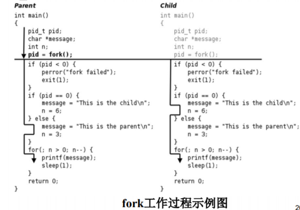
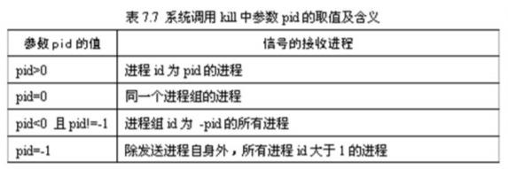
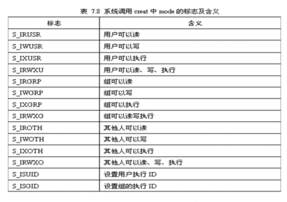
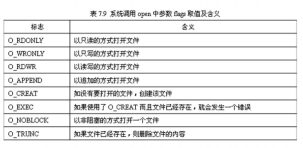

# Linux C编程基础（3） --系统调用

## 进程创建

### 进程创建系统调用

格式

```c
#include <sys/types.h>
#include <unistd.h>
pid_t fork(void);
```

进程调用fork创建一个子进程。若调用成功，在父进程 中返回子进程的pid（进程标识符），在子进程中返回0；调 用失败则返回-1。pid_t表示有符号整型量

### 应用示例

```C
#include <sys/types.h>
#include <unistd.h>
#include <stdio.h>
#include <stdlib.h>
int main(void)
{
    pid_t pid;
    char *message;
    int n;
    pid=fork();
    if (pid<0)
    {
        perror("fork failed");
        exit(1);
    }
    if (pid==0)
    {
        message="this is the child\n";
        n=6;
    }
    else
    {
        message="this is the parent\n";
        n=3;
    }
    for (; n>0;n--)
    {
        printf(message);
        sleep(1);
    }
    return 0;
}
```

编译文件并运行

从运行结果分析fork的工作过程，具体如下

1. 父进程初始化
2. 父进程调用fork创建子进程，fork为系统调用， 因此进入内核
3. 内核根据父进程复制出一个子进程，父进程和 子进程PCB（进程控制块）信息相同，代码和数据也 相同。因此，子进程和父进程一样，做完初始化，刚 调用了fork进入内核，还没有从内核返回，如图7.3 所示



4. 现在有两个一模一样的进程都调用了fork进入 内核等待从内核返回（实际上只有父进程调用了fork 一次），此外系统中还可能有很多其它进程也等待从 内核返回。是父进程先返回还是子进程先返回，还是 这两个进程都等待，系统调度执行了其它的进程，取 决于内核的调度算法
5. 如果某个时刻父进程被调度执行，从内核返回 后就从fork函数返回，返回值是子进程的id，是一个 大于0的整数，因此执下面的else分支，然后执行for 循环，打印"This is the parent"三次之后终止
6. 如果某个时刻子进程被调度执行了，从内核返 回后就从fork函数返回，返回值是0，因此执行下面 的if (pid == 0)分支，然后执行for循环，打印"This is the child"六次之后终止。fork把父进程的数据复 制一份给子进程，但此后二者互不影响，在这个例 子中，调用fork之后父进程和子进程的变量 message和n被赋予不同的值，互不影响
7. 因为父进程每打印一条消息就睡眠1秒，这时 内核调度别的进程执行，在1秒期间（对于计算机来 说1秒很长）子进程很有可能被调度到。同样地，子 进程每打印一条消息也睡眠1秒，在这1秒期间父进 程也很有可能被调度到。所以程序运行的结果基本 上是父子进程交替打印，但这也不是一定的，取决 于系统中其它进程的运行情况和内核的调度算法， 如果系统中其它进程非常繁忙则有可能观察到不同 的结果。另外，也可以把sleep(1）语句去掉观察程 序的运行结果
8. 这个程序是在Shell下运行的，因此Shell进程 是父进程的父进程。父进程运行时Shell进程处于等 待状态，当父进程终止时Shell进程认为命令执行结 束了，于是打印Shell提示符，而事实上子进程这时 还没结束，所以子进程的消息打印到了Shell提示符 后面。最后光标停在This is the child的下一行，这 时用户仍然可以敲命令，即使命令不是紧跟在提示 符后面，Shell也能正确读取

fork函数的特点概括起来就是“调用一次，返回两 次”，在父进程中调用一次，在父进程和子进程中 各返回一次。开始是一个控制流程，调用fork之后 发生分叉，变成两个控制流程，这也就是“fork”这 个名字的由来。子进程中fork的返回值是0，而父进 程中fork的返回值则是子进程的id（从根本上说 fork是从内核返回的，内核自有办法让父进程和子 进程返回不同的值），这样当fork函数返回后，程 序员可以根据返回值的不同让父进程和子进程执行 不同的代码

## 进程执行

### 进程执行系统调用

```c
#include <unistd.h>
extern char **environ;
int execve(const char *filename, char *const argv[], char *const
envp[]);
int execl(const char *path, const char *arg, ...);
int execlp(const char *file, const char *arg, ...);
int execle(const char *path, const char *arg, ..., char * const
envp[]);
int execv(const char *path, char *const argv[]);
int execvp(const char *file, char *const argv[]);
```

上面统称为exec函数系列，只有execve是真正的系统调 用，其它五个函数最终都调用execve

用fork创建子进程后，子进程执行的是和父进程相同的程序（但 有可能执行不同的代码分支），子进程往往要调用exec函数系 列来执行另一个程序。当进程调用exec函数系列时，该进程的 用户空间代码和数据完全被新程序替换，从新程序的启动例程开 始执行

参数path是被执行程序的完整路径名；argv和envp是传给被执 行程序的命令行参数和环境变量；file是文件名，有相应函数自 动到环境变量PATH给定的目录中寻找

### 应用示例

```c
#include <unistd.h>
int main(void)
{
    char *envp[]={ "PATH=/tmp", "USER=txj", "STATUS=testing",
        NULL };
    char *argv_execv[]={ "echo", "excuted by execv", NULL };
    char *argv_execvp[]={ "echo", "executed by execvp", NULL };
    char *argv_execve[]={ "env", NULL };
    if (fork()==0)
        if (execl("/bin/echo", "echo", "executed by execl", NULL)<0)
            perror("Err on execl");
    if (fork()==0)
        if (execlp("echo", "echo", "executed by execlp", NULL)<0)
            perror("Err on execlp");
    if (fork()==0)
        if (execle("/usr/bin/env", "env", NULL, envp)<0)
            perror("Err on execle");
    if (fork()==0)
        if (execv("/bin/echo", argv_execv)<0)
            perror("Err on execv");
    if (fork()==0)
        if (execvp("echo", argv_execvp)<0)
            perror("Err on execvp");
    if (fork()==0)
        if (execve("/usr/bin/env", argv_execve, envp)<0)
            perror("Err on execve");
}
```

编译源文件并运行

## 获取指定进程标识符

### 获得指定进程标识符系统调用

```c
#include <sys/types.h>
#include <unistd.h>
pid_t getpid(void);
pid_t getppid(void);
```

getpid()返回调用该系统调用的进程的id号，getppid()返回调用该系统调用的进程父进程的id号

### 应用示例

```c
#include <sys/types.h>
#include <stdio.h>
#include <unistd.h>
int main(void)
{
    printf("Current process ID:%d\n", (int)getpid());
    printf("Parent process ID:%d \n", (int)getppid());
    return 0;
}
```

编译源文件并运行

## 进程终止

### 进程终止系统调用

```c
#include <stdlib.h>
void exit(int status);
```

exit（）自我终止当前进程，使其进入僵死状态，等待父 进程进行善后处理。status是返回给父进程的一个整数

### 应用示例

```c
#include<stdio.h>
#include<stdlib.h>
int main(void)
{
    printf("This process will exit!\n");
    exit(0);
    printf("Never be displayed!\n");
}
```

编译运行源文件

## 进程等待

### 进程等待系统调用

```c
#include <sys/types.h>
#include <sys/wait.h>
pid_t wait(int *status);
pid_t waitpid(pid_t pid, int *status, int options);
```

wait（）等待任一僵死的子进程，将子进程的退出状态 （退出值、返回码、返回值）保存在参数status中。即进程一旦 调用了wait，就立即阻塞自己，由wait分析是否当前进程的某个 子进程已经退出，如果找到这样一个已经变成僵尸的子进程， wait就会收集这个子进程的信息，并把它彻底销毁后返回；如果 没有找到这样一个子进程，wait就会一直阻塞在这里，直到有一 个出现为止。若成功，返回该终止进程的PID；否则返回-1

waitpid（）等待标识符为pid的子进程退出，将该子 进程的退出状态（退出值、返回码、返回值）保存在 参数status中。参数options规定调用的行为， WNOHANG表示如果没有子进程退出，立即返回0； WUNTRACED表示返回一个已经停止但尚未退出的 子进程信息

### 应用示例

```c
#include <sys/types.h>
#include <sys/wait.h>
#include <unistd.h>
#include <stdio.h>
#include <stdlib.h>
int main(void)
{
    pid_t pid;
    pid = fork();
    if (pid < 0)
    {
        perror("fork failed");
        exit(1);
    }
    if (pid == 0)
    {
        int i;
        for (i = 3; i > 0; i--)
        {
            printf("This is the child\n");
            sleep(1);
        }
        exit(3);
    }
    else
    {
        int stat_val;
        waitpid(pid, &stat_val, 0);
        if (WIFEXITED(stat_val))
            printf("Child exited with code %d\n", WEXITSTATUS(stat_val\
            ));
    }
    return 0;
}
```

编译源文件并运行

从运行结果分析程序的运行过程如下所示

1. 父进程初始化
2. 父进程调用fork，fork为系统调用，因此进入内核。如果fork 不成功，系统显示“fork failed”，如果成功，内核父进程复制出 一个子进程。本示例是fork成功，所以现有父子两个一模一样进程。 但是父进程先返回还是子进程先返回，取决于内核的调度算法
3. 如果子进程先返回，返回值pid为0，执行if (pid == 0)后的语 句，显示三次字符串“This is the child”，exit（3）表示退出 status为3
4. 如果是父进程先返回，返回值pid是子进程的id号，一 个大于0的数，执行if (pid == 0) else后的语句。waitpid(pid, &stat_val, 0)会阻塞父进程等待pid指定的子进程退出，此时 CPU空闲，系统会调度子进程执行，显示三次字符串“This is the child”， 退出status为3，子进程结束后唤醒父进程， 显示Child exited with code 3

## 进程间信号通信

```shell
kill -l
```

几个常用的信号含义如下所示：

- SIGHUP：终端上发出的结束信号
- SIGINT：来自键盘的中断信号（CTRL+C）
- SIGQUIT：来自键盘的退出信号（CTRL +\）
- SIGFPE：浮点异常信号
- SIGKILL：该信号结束接收信号的进程
- SIGALRM：进程的定时器到期，发送该信号
- SIGTERM：kill发送出的信号
- SIGCHLD：标识子进程停止或结束的信号
- SIGSTOP：来自键盘（CTRL+Z）或调试程序的停止信号

### 信号的发送

#### kill

```c
#include <sys/types.h>
#include <signal.h>
int kill(pid_t pid,int signal) 
```

kill向pid进程发送信号signo。调用成功返回0；否则，返回-1。 其中pid参数值不同，接收进程不同



#### raise

```c
#include <signal.h>
int raise(int signal) 
```

raise（）向进程本身发送信号，参数为即将发送的信号值。调用成功返 回0；否则，返回-1

#### alarm

```c
#include <unistd.h>
unsigned int alarm(unsigned int seconds) 
```

alarm（）专门为SIGALRM信号而设，在指定的时间seconds秒后，将 向进程本身发送SIGALRM信号，又称为闹钟时间。进程调用alarm后，任何 以前的alarm（）调用都将无效。如果参数seconds为零，那么进程内将不再 包含任何闹钟时间。如果调用alarm（）前，进程中已经设置了闹钟时间，则 返回上一个闹钟时间的剩余时间，否则返回0

### 信号的接收

Linux主要有两个系统调用实现信号的接收，signal（）和 sigaction（）。其中signal（）在可靠信号系统调用的基础上 实现, 是库函数。它只有两个参数，不支持信号传递信息，主要 是用于前32种非实时信号的接收；sigaction（）是较新的函数， 有三个参数，支持信号传递信息，sigaction（）优于signal （），主要体现在前者支持信号带有参数

#### signal

```c
#include <signal.h>
typedef void (*sighandler_t)(int);
sighandler_t signal(int signum, sighandler_t handler)); 
```

signal（）负责接收指定信号signum，并进行相应处理。第一个 参数指定信号的值，第二个参数指定针对前面信号值的处理，如果 signal（）调用成功，返回最后一次为接收信号signum而调用signal （）时的handler值；失败则返回SIG_ERR

#### sigaction

```c
#include <signal.h>
int sigaction(int signum,const struct sigaction *act,struct
sigaction *oldact); 
```

sigaction（）用于改变进程接收到特定信号后的行为。该 函数的第一个参数为信号的值，可以为除SIGKILL及SIGSTOP 外的任何一个特定有效的信号。第二个参数是指向结构 sigaction的一个实例的指针，在结构sigaction的实例中，指定 了对特定信号的处理，可以为空，进程会以缺省方式对信号处理； 第三个参数oldact指向的对象用来保存原来对相应信号的处理， 可指定oldact为NULL

### 信号应用示例

```c
#include <unistd.h>
#include<stdio.h>
int main(void)
{
    unsigned int i;
    alarm(1);
    for (i=0;1;i++)
        printf("I=%d", i);
}
```

编译源文件并执行

```c
#include<sys/file.h>
#include<stdio.h>
#include<signal.h>
#include<unistd.h>
#include<stdlib.h>
void waiting();
void stop();
int wait_mark;
int main(void)
{
    signal(SIGINT, stop);
    int p1, p2, stdout;
    while ((p1=fork())==-1);
    if (p1>0)
    {
        while ((p2=fork())==-1);
        if (p2>0)
        {
            wait_mark=1;
            waiting();
            kill(p1, 10);
            kill(p2, 12);
            wait(0);
            wait(0);
            printf(" parent process is killed !\n");
            exit(0);
        }
        else
        {
            wait_mark=1;
            signal(12, stop);
            waiting();
            printf("chlid process 2 is killed by parrent!\n");
            exit(0);
        }
    }
    else
    {
        wait_mark=1;
        signal(10, stop);
        waiting();
        printf("chlid process 1 is killed by parrent!\n");
        exit(0);
    }
}
void waiting()
{
    while (wait_mark == 1);
}
void stop()
{
    wait_mark=0;
}
```

## 线程控制系统调用

### 线程创建

```c
#include <pthread.h>
int pthread_create(pthread_t *thread, const pthread_attr_t
*attr, void *(*start_routine) (void *), void *arg);
```

pthread_create（）为调用的进程创建一个新线程。其 中参数thread为线程标识符、attr为线程属性设置、 start_routine为线程函数起始地址、arg为传递给start_routine 的参数。创建线程成功时，返回0，创建线程失败，返回错误号。 pthread_create是通过系统调用clone来实现的，clone是Linux 特有的系统调用，类似进程创建的系统调用fork（）

### 获得线程标识符

```c
#include <pthread.h>
pthread_t pthread_self(void);
```

pthread_t pthread_self（）返回调用的线程的标识符。 每个线程都有自己的线程标识符，以便在进程内区分，线程标 识符在pthread_create创建时产生

### 线程等待

```c
#include <pthread.h>
int pthread_join(pthread_t thread, void **retval);
```

pthread_join（）将调用它的线程阻塞，一直等到被等待 的线程结束为止，当函数返回时，被等待线程的资源被收回。第 一个参数thread为被等待的线程标识符，第二个参数retval为用 户定义的指针，存放被等待线程的返回值

### 线程退出

```c
#include <pthread.h>
void pthread_exit(void *retval);
int pthread_cancel(pthread_t thread);
```

pthread_exit（）终止调用线程，retval为线程的返回值； pthread_cancel终止由参数thread 指定的线程

## 线程控制函数

```c
#include <stdio.h>
#include <pthread.h>
void thread(void)
{
    int i;
    for (i=0;i<3;i++)
        printf("This is a pthread.\n");
}
int main(void)
{
    pthread_t id;
    int i, ret;
    ret=pthread_create(&id, NULL, (void *)thread, NULL);
    if (ret!=0)
    {
        printf("Create pthread error!\n");
        exit(1);
    }
    for (i=0;i<3;i++)
        printf("This is the main process.\n");
    pthread_join(id, NULL);
    return(0);
}
```

编译程序并运行，因线程相关函数是运行在用 户空间的线程库pthread.h实现，所以编译的时候要加上lpthread选项

## 文件系统系统调用

### 创建文件

#### 创建文件系统调用

```c
#include <sys/types.h>
#include <sys/stat.h>
#include <fcntl.h>
int creat(const char *pathname, mode_t mode);
```

creat（）创建新文件，如果创建文件成功，返回打开新 创建文件的描述符；若不成功，返回-1。其中参数pathname为 指向文件名字符串的指针，参数mode指定新建文件的存取权限， mode的组合情况如表7.8所示



也可以用八进制数表示文件权限，比如0744表示文件权限为“- rwxr--r--”

```c
creat("test", 0744);
```

该命令等价于creat("test", S_IRWXU | S_IRGRP | S_IROTH );

#### 创建文件系统调用示例

```c
#include <stdio.h>
#include <stdlib.h>
#include<fcntl.h>
int main(void)
{
    int fd;
    fd=creat("test.txt", 0700);
    if (fd==-1)
    {
        perror("fail to creat");
        exit(1);
    }
    else
        printf("creat OK\n");
    close(fd);
    return 0;
}
```

编译并运行程序

用ls –l命令查看新创建的文件

### 打开文件、关闭文件

#### 打开文件系统调用

```c
#include <sys/types.h>
#include <sys/stat.h>
#include <fcntl.h>
int open(const char *pathname, int flags);
int open(const char *pathname, int flags, mode_t mode);
```

open（）打开指定文件。open函数有两个形式，其中 pathname是要打开的文件名(包含路径名称，缺省是认为在当前路径下 面)，flags可以是表7.9中一个值或者是几个值的组合。在打开一个不存 在的文件时才用mode参数指定文件的权限。用来表示文件的访问权限， 详见建立文件系统调用

文件打开成功，open函数会返回一个文件描述符，以后对该文件的所 有操作就可以通过对这个文件描述符进行操作来实现；若不成功，返回 -1



#### 关闭文件系统调用

```c
int close(int fd);
```

关闭文件系统调用，调用成功返回0，出错返回-1并设置 errno。参数fd是要关闭的文件描述符，由open系统调用返回。 关闭文件和打开文件是配对的，即打开的文件最好要显式的关闭

#### 打开、关闭文件系统调用示例

```c
#include <stdio.h>
#include <stdlib.h>
#include<fcntl.h>
int main(void)
{
    int fd;
    fd=open("test.txt", O_RDWR|O_CREAT, 0700);
    if (fd==-1)
    {
        perror("fail to open");
        exit(1);
    }
    else
        printf("Open OK\n");
    close(fd);
    return 0;
}
```

编译文件并运行

成功的在当前目录下新建一名为test.txt的文件，并打开该文件， 用ls-l命令可查看该文件详细信息

删除并再次运行

用ls –l命令查看test.txt文件的详细信息

### 读写文件

#### 读文件系统调用

```c
#include <unistd.h>
ssize_t read(int fd, void *buf, size_t count);
```

read（）从文件描述符fd所表示的文件中读取count字节 的数据，放到缓冲区buf中。如果成功则返回读取的字节数；出 错返回-1，错误代码保存在全局变量errno中；如果在调read之 前已到达文件末尾，则这次read返回0

#### 读写文件系统调用示例

```c
#include <sys/types.h>
#include <sys/stat.h>
#include <fcntl.h>
#include <stdio.h>
#include<string.h>
#define LENGTH 100
```

编译文件并运行程序

在当前目录下创建用户可读写文件“hello.txt”，在其中 写入“Hello, software weekly”，关闭该文件。再次打开该文件， 读取其中的内容并输出在屏幕上。通过ls命令可观察在当前目录 下新建了一个名为hello.txt的文件

### 文件定位

#### 文件定位系统调用

```c
#include <sys/types.h>
#include <unistd.h>
off_t lseek(int fd, off_t offset, int whence);
```

lseek（）对文件描述符fd所表示文件的读写指针进行设 置。调用成功返回目前的读写位置，也就是距离文件开头多少个 字符；错误则返回-1, errno会存放错误代码

每一个已打开的文件都有一个读写位置，当打开文件时通常其读 写位置是指向文件开头，若是以附加的方式打开文件（如 O_APPEND），读写位置会指向文件尾。当read（）或write（） 时，读写位置会随之增加，lseek（）便是用来控制该文件的读 写位置。参数fd为已打开的文件描述符，参数offset为根据参数 whence来移动读写位置的位移数。参数whence为下列其中一 种

- SEEK_SET：参数offset即为新的读写位置
- SEEK_CUR：当前读写位置后增加offset个位移量
- SEEK_END：将读写位置指向文件尾后再增加offset个位移量

几个比较特殊的应用如下所示

- 将读写位置移到以fildes为描述符的文件开头

  ```c
  lseek(int fildes, 0, SEEK_SET)
  ```

- 将读写位置移到以fildes为描述符的文件尾

  ```c
  lseek(int fildes, 0, SEEK_END)
  ```

- 将取得以fildes为描述符的文件的目前文件位置

  ```c
  lseek(int fildes, 0, SEEK_CUR)
  ```

#### 文件定位系统调用示例

```c
#include <stdio.h>
#include <stdio.h>
#include <stdlib.h>
#include <fcntl.h>
#include <unistd.h>
#define MAX 1024
int main(void)
{
    int fd;
    off_t off;
    char buf[MAX];
    fd=open("test.txt", O_RDWR);
    if (fd==-1)
    {
        perror("fail to open");
        exit(1);
    }
    printf("before reading\n");
    off=lseek(fd, 0, SEEK_CUR);
    if (off==-1)
    {
        perror("fail to lseek");
        exit(1);
    }
    printf("the offset is :%d\n", off);
    if (read(fd, buf, 5)==-1)
    {
        perror("fail to read");
        exit(1);
    }
    printf("after reading\n");
    off=lseek(fd, 0, SEEK_CUR);
    if (off==-1)
    {
        perror("fail to lseek");
        exit(1);
    }
    printf("the offset is :%d\n", off);
    close(fd);
}
```

编译文件并运行程序