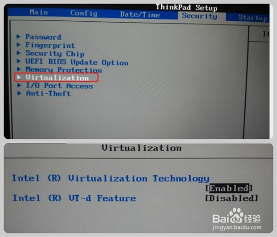

# Linux系统安装与基本使用

## Linux安装

安装程序的引导方式

1. 光盘引导
2. 网络引导

软件包读取方式

1. 光盘

   默认的方式，通过本机的光盘设备提供安装文件

2. 硬盘

   通过本地硬盘中的 .ISO 镜像提供安装文件

3. 网络服务器

   通过NFS、FTP或HTTP服务器提供安装文件

#### 安装虚拟机

演示使用的[VMware Workstation 15 Player](https://www.vmware.com/products/workstation-player/workstation-player-evaluation.html)和[Kubuntu 20.04](https://kubuntu.org/getkubuntu/)

发行版具体可以参考[FAQ](../FAQ/FAQ.md)

#### VMware

注意：64位的操作系统需要vmware10以上的版本，需要打开电脑的虚拟化功能，BIOS中的Virtualization设为enabled（部分电脑需要此设置）



#### 安装配置

1. 选择系统的安装位置，在此也可以手动分区，或者选择自动分区（默认则为自动分区）

一个最简单的分区方案一般应该包括三个分区：
（1）引导分区  用来存放引导文件、内核等，挂载点为 /boot，分区大小建议500M
（2）交换分区  挂载点为swap，通常是物理内存的2倍，生产环境中物理 内存小于4G建议2倍，4-16G建议等于物理内存，大于16G建议为物理内存的一半
（3）根分区   用于存放系统中的用户数据、配置文件等，剩余空间建议分给根分区

2. 设置管理员（root）的密码
3. 创建一个普通用户

#### 系统启动过程

现在不理解可以等计算机组成原理学习完后再来体会。

（1）BIOS启动引导阶段
大多数Linux发行版本使用的引导加载程序有三种：GRUB，GRUB2和LILO。GRUB2是最新的，也是同类程序中使用最广的。
（2）GRUB2启动引导阶段
GRUB2是CentOS7默认的引导加载程序，GRUB2的配置文件位于/boot/grub2/grub.cfg。GRUB2将vmlinuz内核映像文件加载到内存中。
（3）内核阶段
内核是操作系统的核心，是系统启动时加载的第一个程序。系统启动内核从initrd.img（initrd是一种基于内存的文件系统，启动过程中，系统在访问真正的根文件系统时，会先访问initrd文件系统）将所有必需驱动模块加载到Linux系统中并运行1号进程systemd。
（4）systemd进程初始化
Systemd 进程是在Linux系统上运行的第一个进程（PID为1），它初始化系统并启动init（/etc/init.d）进程曾经启动的所有服务，读取配置文件，在目标runlevel.target中加载操作系统。

## Linux基本使用

#### 图形界面与控制台

Linux的运维服务一般是在命令行下进行的，在Linux系统的图形化桌面环境中提供了模拟终端命令行界面的方式，终端方式允许用户通过输入命令使用计算机。

Debian下(包括Ubuntu、Deepin)，终端快捷键是ctrl+alt+t

在命令提示符中：
@符号之前，是当前登录的用户名。
@符号之后到：符号之前，是计算机的主机名（hostname）。
:符号之后到$符号之前，是当前目录。
$符号，是普通用户的命令提示符，提示用户可以在此提示符之后输入Shell命令。
#符号，Linux的最高权限用户root的提示符
默认普通用户是用$作为提示符的

#### Linux字符界面

查看计算机系统启动后要进入的默认目标，graphical.target表示图形化界面

```bash
systemctl get-default
```

将multi-user.target目标设置为启动计算机系统后要进入的默认目标， multi-user.target表示字符界面

```shell
systemctl set-default multi-user.target
```

恢复图形界面？

```shell
startx
```

```shell
systemctl set-default graphical.target
```

#### 虚拟控制台

Linux系统可以同时接受多个用户登录，还允许用户在同一时间进行多次登录，因为Linux系统提供了虚拟控制台的访问方式。

Ctrl+Alt+F1可以从字符界面的虚拟终端切换到图形化用户界面
Ctrl+Alt+F2——Ctrl+Alt+F6可以从图形化用户界面切换到字符界面的虚拟终端

虚拟机上操作不方便，需要更改VMware快捷键。

#### VMware中和Windows进行交互

实际演示

### Linux的基本命令

区分大小写

#### 1.更改密码

```shell
passwd
```

更改用户密码

#### 2.--help选项

```shell
passwd --help
```

--help选项放在命令之后，用来显示命令的信息

#### 3.man命令

```shell
man passwd
```

显示系统文档中的manual页内容

#### 4.info命令

```shell
info passwd
```

是一个基于菜单的超文本系统，是由GNU项目开发并由Linux发布的

#### 5.who命令

```shell
who
```

用于查看当前登录到系统的用户信息

#### 6.uname命令

```shell
uname
```

显示正在使用的Linux系统信息

- r：显示操作系统的内核发行号(Release Number)
- n：显示网络上本机的节点名(Node Name)
- v：显示操作系统的内核版本号(Version Number)

#### 7.date命令

```shell
date
```

显示或设置系统的时间

#### 8.cal命令

```shell
cal [month] [year]
```

在屏幕上输出日历信息

#### 9.echo命令

```shell
echo string
```

用于回显输入内容

#### 10.clear命令

```shell
clear
```

清除shell窗口中的内容

#### 11.su命令

```shell
su
```

用户进入到系统后，切换到其他用户，使用su命令

退回到原来用户使用exit命令

若想成功切换需要切换用户账号的密码

#### 12.注销、重启、关机

注销：在shell窗口键入exit命令或logout命令或者ctrl+D
如果是控制台终端下：退出当前shell程序后，系统又回到控制台终端的login（登录）界面
如果是图形界面的终端下：退出后系统自动关闭该终端，回到图形桌面。
重启   reboot、shutdown –r now
关机   halt、shutdown –h now

演示（需要管理员权限）：

立即关闭计算机。

```shell
shutdown –h now
```

15分钟后关闭计算机系统。

```shell
shutdown –h +15
```

10分钟后重启计算机系统并发出警告信息。

```shell
shutdown  –r  +10  “system will reboot .”
```

#### 注意

个别命令可在Windows的powershell下运行，大部分可以在MacOS的terminal下运行。Windows不区分大小写。

## 软件安装

在Linux系统中，需要安装的软件，Debian系一般通过apt安装或deb软件包的管理，RHEL系一般通过yum安装或rpm软件包的管理

1. 图像化软件商店安装
2. 命令行安装

#### 软件包的封装类型

| **封装类型**         | **说明**                                                     |
| -------------------- | ------------------------------------------------------------ |
| rpm软件包            | 扩展名为.rpm                                                 |
| deb软件包            | 扩展名为.deb                                                 |
| 源代码软件包         | 一般为.tar.gz、.tar.bz2等格式的压缩包包含程序的原始代码      |
| 提供安装程序的软件包 | 在压缩包内提供install.sh、setup等安装程序或以.bin格式的单个执行文件提供 |
| 绿色免安装的软件包   | 在压缩包内提供已编译好的执行程序文件解开压缩包后的文件即可直接使用 |

apt包管理器：
    安装、卸载、更新包括操作系统的包

​    更新索引、更新包、自动解决依赖问题

基本用法：
sudo apt update 更新索引（通过更新源（/etc/apt/sources.list）更新）

apt list --upgradable 查看可用更新

sudo apt upgrade 更新已安装软件包

sudo apt dist-upgrade 更新新包，删除旧包

sudo apt install <package> 安装软件包

sudo apt remove <package> --purge或者sudo apt purge <package> 删除软件包并删除配置文件

## Linux的GUI

Linux的DE(Desktop Environment)多种多样