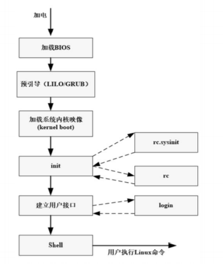
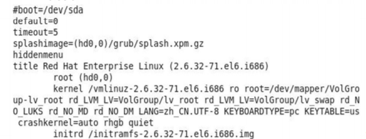
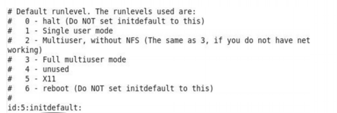
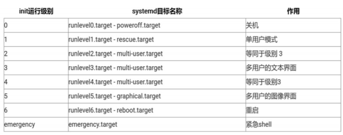
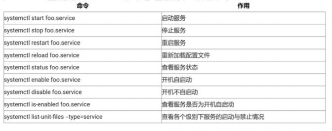
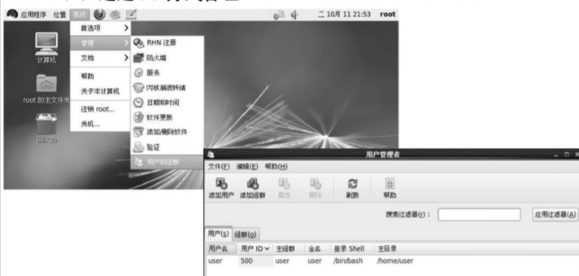

# Linux系统管理基础（1）

## 系统启动、运行和关闭

### 系统启动



##### GRUB

GNU GRUB(GRand Unified Bootloader)是一个将引导装载程序安装到主引导记录的程序。

它允许位于主引导记录区中特定的指令来装载一个GRUB菜单或是GRUB的命令环境。

例子：



各项含义解释如下：

字符#--为配置文件注释信息。
default---默认启动的操作系统的编号。0表示菜单指示第一个OS默认启动。如果菜单接口超时，那它将被载入。
timeout---设定了在GRUB载入由default命令指定的OS前的时间间隔，以秒为单位。
splashimage---指定在GRUB引导时所使用的屏幕图像的位置。
hiddenmenu---不显示GRUB菜单接口，在超时时间过期后载入默认项。
title---设定用来装载一个操作系统的一组特定命令的标题。
root(hd0,0)---将GRUB的根分区设置成第一块硬盘的第一个分区。
kernel /vmlinuz-2.6.32-71.el6.i686 ro root---表明了vmlinuz文件是从GRUB的根文件系统载入的。
initrd---使用户能够指定一个在引导时可用的初始RAM盘。当内核为了完全引导而需要某些模块时，这是必需的。

##### 系统运行级别

Linux系统提供7种运行级别（redhat 6）

0：系统停机状态，系统默认运行级别不能设为0，否则不能正常启动。
1：单用户工作状态，root权限，用于系统维护，禁止远程登陆。
2：多用户状态（没有NFS支持）
3：完全的多用户状态（有NFS），标准运行级别，登录后进入命令行模式。
4：系统未使用，保留。
5：多用户模式，X11控制台，登录后进入GUI模式。
6：系统正常关闭并重启，默认运行级别不能设为6，否则不能正常启动。

运行级别配置文件/etc/inittab



id:runlevels:action:process

id是一个唯一标识符，由1~4个字符构成，通常与登录终端tty编号 一致。

runlevels表示系统的运行级别。当前为5，为多用户图形模式的运 行级别。action表示要执行的操作。当前为initdefault，表示系统启动后的 默认运行级别。如果没有该记录，系统启动时在控制台询问要进入 哪个运行级别。

process指明具体应该执行的程序。由于initdefault设定进入相应 的运行级别会激活对应级别的进程，所以对于指定process字段没 有任何意义，因此为空。

在redhat7中，已经没有“运行级别”这个概念了，linux系统在启动 时要进行大量的初始化工作，比如挂载文件系统和交换分区、启动各 类进程服务等，这些都可以看作是一个一个的单元（Unit），systemd 用目标（target）代替了System V init 中运行级别的概念，区别如图



如果需要将系统默认运行的目标修改为“多用户，无图形”模式，可以直接 用ln 命令把多用户模式目标文件连接到/etc/systemd/system/目录：

```shell
ln -sf /lib/systemd/system/multi-user.target /etc/systemd/system/default.target
```

在redhat7上使用systemctl命令管理服务，常用命令：



运行级别切换

1. 查看运行级别

   ```shell
   runlevel
   ```

2. 进入其他运行级别

   ```shell
   init N
   ```

   其中N表示0~6的数字，如init 3表示切换到运行级别3

### 系统关闭

- 只有超级用户才有权执行关机命令
- 关闭系统可分为三种情形：
  - 关掉
  - 不关电源只关机
  - 重新引导
- shutdown、halt、reboot、init

#### shutdown

```shell
shutdown [-fFhknrc(参数名称)] [-t 秒数] 时间 [警告信息]
```

立即关机重启

```shell
shutdown –r now
```

立即关机

```shell
shutdown -h now
```

#### halt

相当于shutdown -h

#### reboot

关机后引发系统重启

#### init

主要用于系统不同运行级之间的切换

## 用户管理

### 用户类型

超级用户：root

普通用户

特殊用户：在Linux系统中还存在一些特殊的与系统和程序服务相关的用户

注意：默认情况下特殊用户无法登录

### 用户管理的信息包括

1. 用户账号（用户名）的增加、修改和删除
2. 组账号（组名）的增加、修改和删除
3. 用户账号属性信息的修改，包括登录shell，用户主目录，用 户注释信息等
4. 组账号属性信息的修改，包括组内用户、组ID等
5. 用户和组账号密码的设置与修改，包括密码有效期、更改密 码等

### 用户管理方法

通过GUI方式管理、通过修改用户管理相关配置文件管理、通过系统管理命令管理

#### GUI方式



#### 修改用户管理相关配置文件


#### 系统管理命令