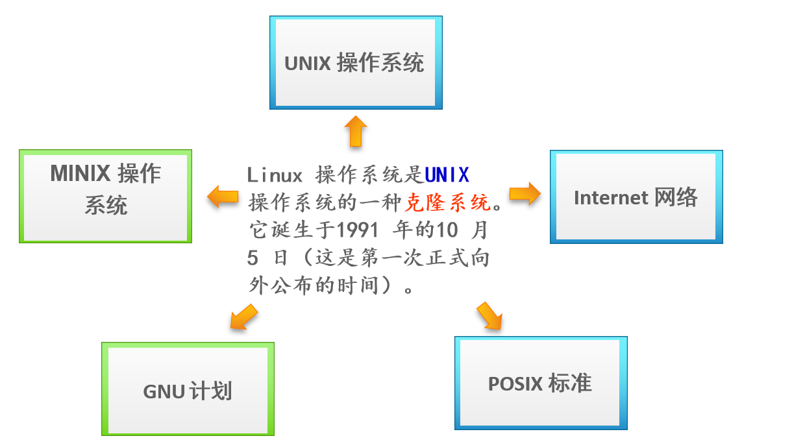
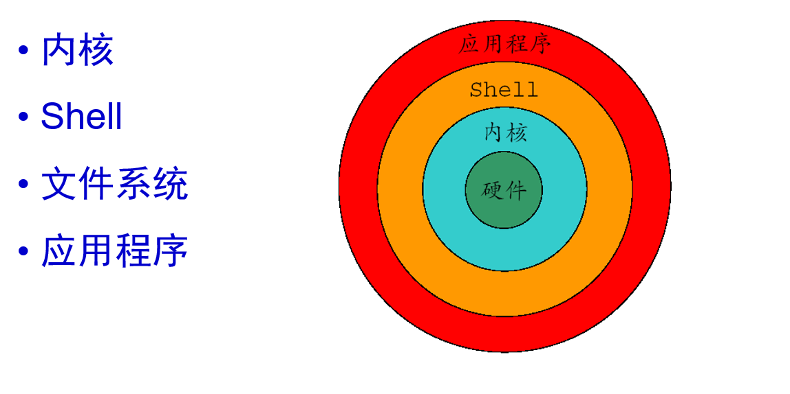
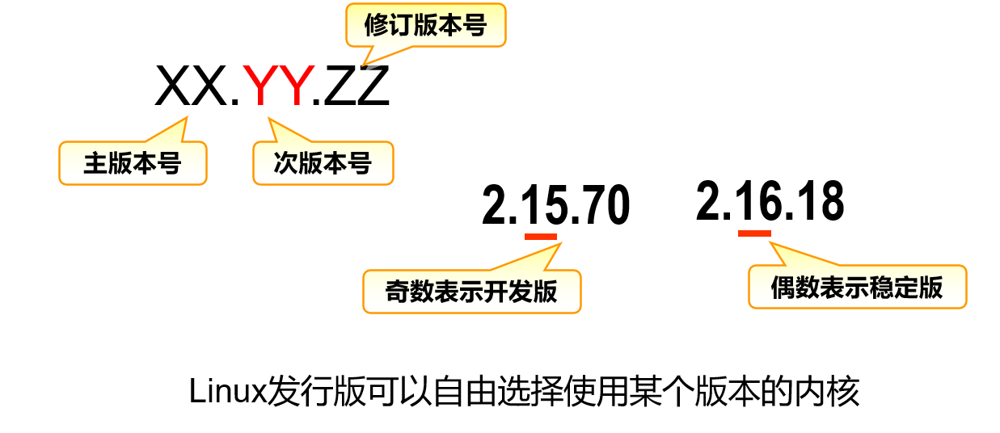
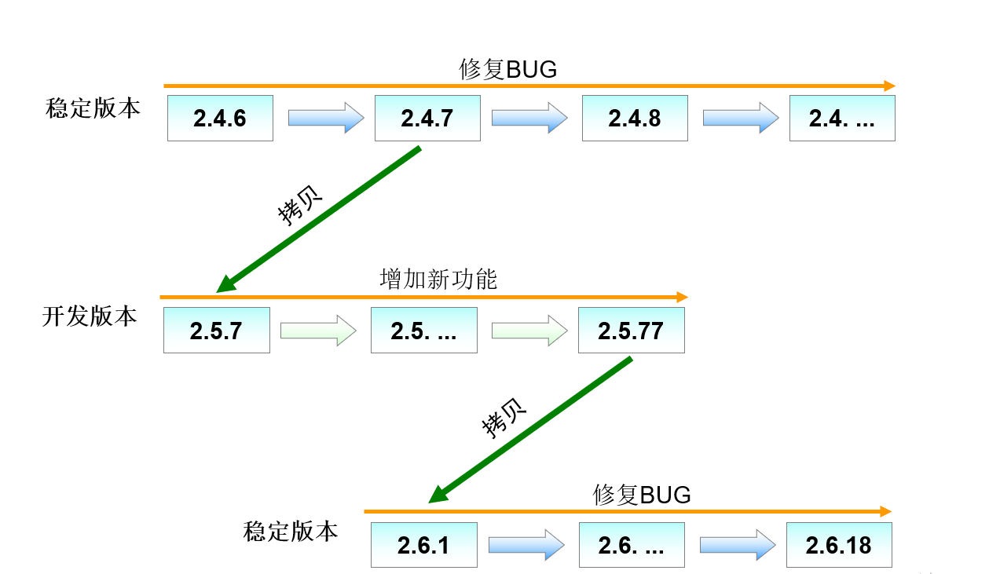

# Linux系统概述  

## 操作系统

Windows

MacOS

Linux

## 为何学习Linux

#### Linux的特点

1. Linux是一套***<u>免费使用和自由传播</u>***的类Unix操作系统；

2. Linux是一个基于POSIX和UNIX的***<u>多用户、多任务、支持多线程</u>***和多CPU的操作系统。

3. Linux继承了Unix以***<u>网络</u>***为核心的设计思想，是一个性能稳定的多用户网络操作系统。

4. Linux能运行主要的UNIX工具软件、应用程序和网络协议；

5. Linux支持32位和64位硬件。

##### 免费开放

##### 多线程

##### 网络

##### 可靠安全、性能稳定

##### 支持多平台

### ***<u>Android</u>***

## Linux诞生与发展

1. Unix

   **世界上第一个完善的网络操作系统**

2. Minix

   MINIX 系统是由荷兰阿姆斯特丹vrije大学Andrew S. Tanenbaum(AST)教授开发的。他为了保持minix 的小型化，能让学生在一个学期内就能学完，而没有接纳全世界许多人对Minix 的扩展要求。

   作为一个操作系统，MINIX 并不是优秀者，但它同时提供了用C 语言和汇编语言写的系统源代码。这是第一次使得有抱负的程序员或hacker 能够阅读操作系统的源代码，在当时这种源代码是软件商一直小心地守护着的。

3. GNU（GNU is Not Unix） 
   1984年由Richard Stallman发起并创建
   目标是编写大量兼容于Unix系统的自由软件

4. Linux操作系统

   1991年的10月5日，Linus Torvalds在comp.os.minix新闻组上发布消息，正式向外宣布Linux内核的诞生

5. Internet

   托瓦兹的 Linux 得益于自愿传送修补程式的骇客志工， 其实都没有见过面，而且彼此在地球的各个角落，大家群策群力的共同发展出现今的 Linux ， 我们称这群人为虚拟团队！

## 系统组成

内核+应用程序

1. 内核

   内核是操作系统的核心，具有很多最基本的功能，如虚拟内存、多任务、共享库、需求加载、可执行程序和TCP/IP网络功能。

   Linux内核的主要模块分为存储管理、CPU和进程管理、文件系统、设备管理和驱动、网络通信、系统的初始化和系统调用等几个部分。

2. Shell

   Shell是系统的用户界面，提供了用户与内核进行交互操作的一种接口。它接收用户输入的命令并把它送入内核去执行。

   Shell是一个命令解释器，它解释由用户输入的命令并且将它们送到内核。

   Shell也可作为编程语言，具有普通编程语言的很多特点，用这种编程语言编写的Shell程序与其他应用程序具有同样的效果。 

3. 文件系统

   文件系统是文件存放在磁盘等存储设备上的组织方法。

    Linux系统能支持多种目前流行的文件系统，如ext3、ext4、XFS、FAT、VFAT、NTFS和ISO9660等。 

4. 应用程序

   标准的Linux系统都有一套称为应用程序的程序集，它包括文本编辑器、编程语言、X Window、办公软件和Internet工具等。 

## Linux版本

内核版本：1993年3月14日，Linux推出第一个正式的内核版本1.0，首次成为一个完整的操作系统，在后来的发展中，Linux内核版本的命名一直遵从以下规则：即内核版本号由形如 x1.x2.x3这三组数字组成，例如：3.10.0-327、4.4.3-1、5.3.6-1等等。

发行版本：基于Linux内核的图形界面，同时配上很多功能强大的应用软件

1. 内核版本

   

   

2. 发行版本

   Linux发行版本构成
   Linux内核 ＋ 各种自由软件 ＝ 完整的操作系统
   厂商提供的辅助安装、软件包管理等程序
   发行版的名称、版本由发行厂商决定
   Red Hat Enterprise Linux 7，由Red Hat公司发布
   Suse Linux 11，由Novell公司发布
   Debian Linux 7.5，由Debian社区发布

