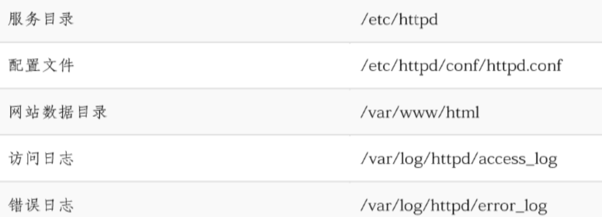
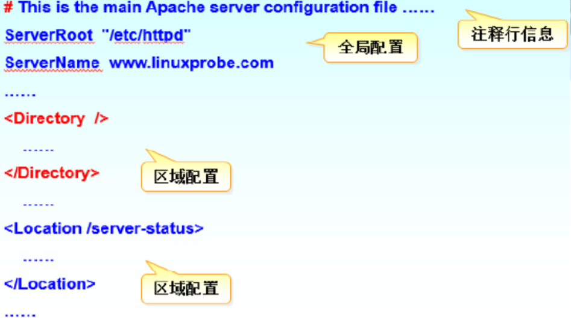
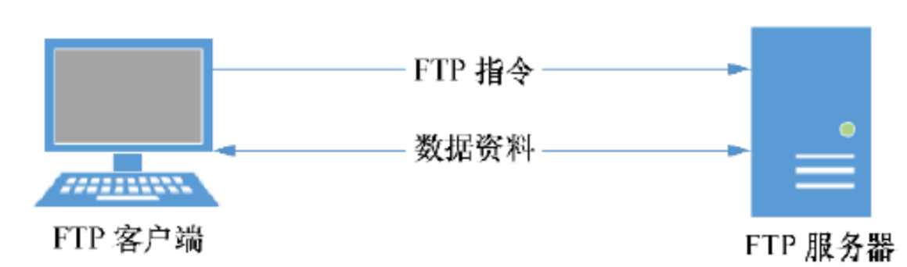
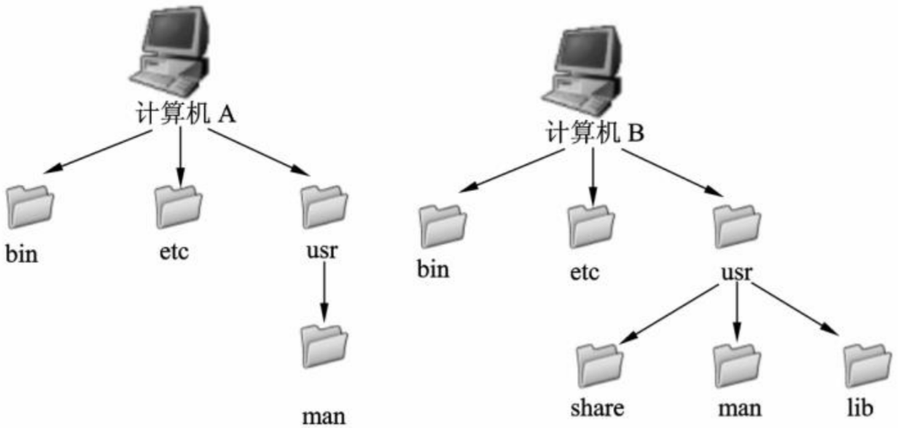
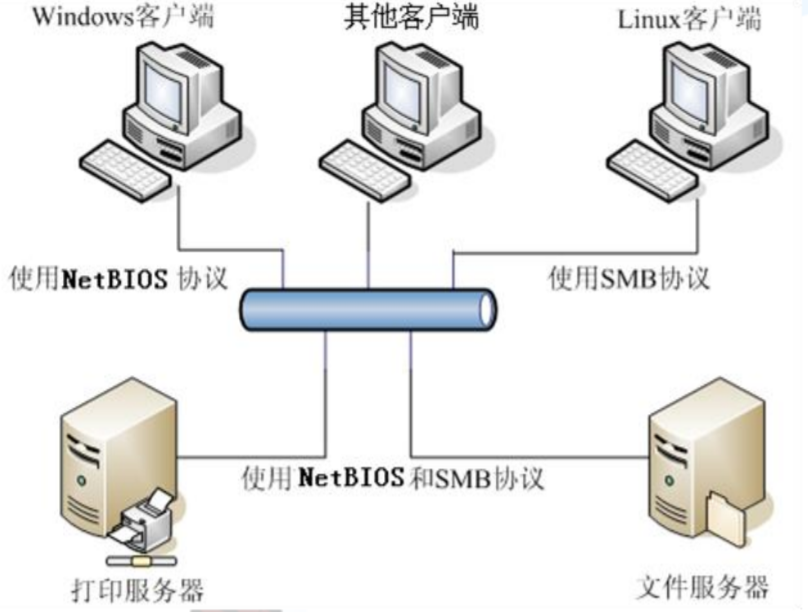

# Linux网络管理及服务（2）

## Web服务器配置

Linux很适合作各种服务器，对于Linux系统而言能轻易的搭建起支持PHP或者JSP的服务器，在Linux下面实现web服务，通常使用Apache来实现

在没有安装配置前提下访问服务器： 浏览器网址输入localhost或者127.0.0.1，显示连接失败

### 安装服务器

httpd

```shell
sudo apt install httpd
```

### 启动web服务并将web服务加入到开机启动项中

#### 启动、终止、重启

```shell
systemctl start httpd.service
```

```shell
systemctl stop httpd.service 
```

```shell
systemctl restart httpd.service
```

#### 设置开机启动/关闭

```shell
systemctl enable httpd.service
```

```shell
systemctl disable httpd.service
```

#### 检查httpd状态

```shell
systemctl status httpd.service
```

### 地址栏输入localhost或127.0.0.1

### Web服务的主要配置文件



主要配置文件httpd.conf的基本格式



## 构建虚拟Web主机

WWW服务器虚拟主机技术是指使用同一台WWW服务器，运行多个不同的网站服务并且互不干扰的技术

虚拟主机技术分为三种：

- 基于域名
- 基于IP地址
- 基于端口号

## FTP服务器配置

FTP文件传送协议(File Transfer Protocol，简称FTP)，是一个用于从一台主机到另一台主机传输文件的协议



Linux下有许多FTP服务器软件可供选择，常见的有

- Proftpd
- Wu-FTP
- vsftp

## NFS设置

NFS是Network File System的简写，即网络文件系统。是Unix、Linux支持的文件系统中的一种。NFS允许一个系统在网络上与它人共享目录和文件。（应用于Linux主机之间）

NFS采用的是C/S体系结构，至少有两个主要部分：一台服务器 和一台（或者更多）客户机

为什么要采用NFS？

- 本地工作站使用更少的磁盘空间，因为通常的数据可以存放在另一 台机器上而且可以通过网络访问到
- 用户不必在每个网络上机器中都有一个home目录。home目录可 以被放在NFS服务器上并且在网络上处处可用
- 诸如CDROM之类的存储设备可以在网络上面共享被别的机器使用。 这可以减少整个网络上的可移动存储设备的数量



假设要把B计算机上的/usr/man挂载到A的/usr/man，首先得在B机器 上安装NFS服务器端软件并完成配置，然后只需要在A主机上运行 mount -t nfs B_machine_name（or IP）:/usr/man /usr/man就可达 到共享目的

## Samba配置

SMB（Server Message Block）通信协议是微软和英特尔在1987年制定的 协议，主要是作为Microsoft网络通讯协议。SMB协议通常是被Windows系 列用来实现磁盘和打印机共享(windows主机与Linux主机间文件共享)

Samba就是在Linux和UNIX系统上实现SMB协议的一个免费软件，采用的是 C/S结构，由服务器及客户端程序构成



提供Windows风格的文件和打印机共享。Windows操作系统可 以利用Samba共享Linux等其他操作系统上的资源，而从外表看 起来和共享Windows的资源没有区别

在Windows网络中解析NetBIOS的名字。为了能够利用局域网 上的资源，同时使自己的资源也能被别人所利用，各个主机都定 期地向局域网广播自己的身份信息。负责收集这些信息，提供检 索的服务器也被称为浏览服务器，而Samba能够实现这项功能。 同时在跨越网关的时候Samba还可以作为WINS服务器使用

提供SMB客户功能。利用Samba程序集提供的smbclient程序可 以在Linux中以类似于FTP的方式访问Windows共享资源

## DNS服务器配置

简单说：域名解析是把域名指向网站空间IP，让人们利用好 记忆的域名方便访问到网站的一种服务。IP地址是网络上标 识站点的数字地址，但不方便记忆，因此采用域名来代替。 域名解析就是域名到IP地址、IP到域名的转换过程。域名的 解析工作由DNS服务器完成

DNS服务器又分为主DNS服务器，辅/从DNS服务器，缓存 DNS服务器，转发DNS服务器等多种类型，每种服务器在域 名服务系统中所起的作用都不一样

BIND（Berkeley Internet Name Domain，伯克利因特网 名称域）服务是全球范围内使用最 广泛、最安全可靠且高 效的域名解析服务程序。现有版本大多Linux分发版本通过 bind服务程序实现域名服务器的配置

## Mail服务器配置

邮件服务器涉及到的协议有SMTP，POP，IMAP。根据用途的不 同，可以将邮件服务器分为发送邮件服务器(SMTP服务器)和接 收邮件服务器(POP3服务器或IMAP4服务器)

- SMTP即简单邮件传输协议，它是一组用于由源地址到目的地址传 送邮件的规则，由它来控制信件的中转方式
- POP3即邮局协议的第3个版本，它规定怎样将个人计算机连接到 Internet的邮件服务器和下载电子邮件的协议。它是Internet电子邮 件的第一个离线协议标准
- IMAP4即Internet信息访问协议的第4个版本，是用于从本地服务器 上访问电子邮件的协议

Redhat7之前使用的sendmail服务程序配置邮件服务器，目前使 用Postfix服务程序实现邮件服务器