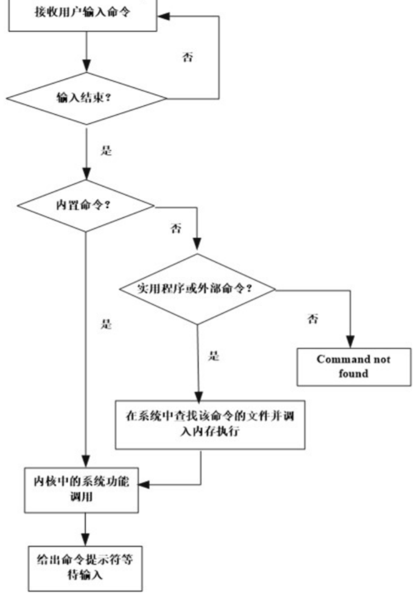
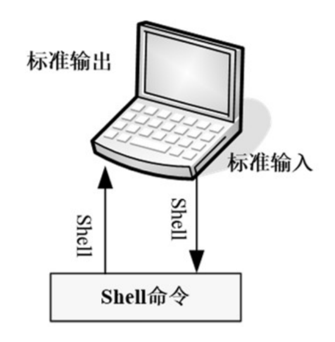
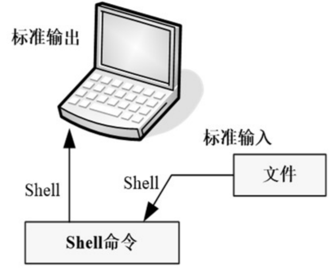
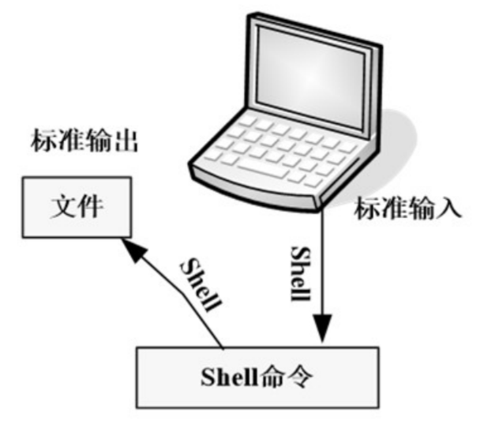

# Shell编程（1）

## Shell简介

在Linux操作系统中，shell是用户与操作系统内核打交道的接口

Linux中的shell有多种类型，最常用的几种是Bourne shell（sh）、C shell（csh）和Korn shell（ksh）

### Bourne shell（sh）

Bourne shell是UNIX最初使用的shell，并且在每种UNIX上都可以使用

Bourne shell在shell编程方面相当优秀，但在处理与用户的交互方面做得不如其他几种shell。 

Linux操作系统缺省的shell是bash，与Bourne shell全向后兼容，并且在Bourne shell的基础上增加、增强了很多特性。在Linux系统下面，sh是bash的符号链接

### C shell (csh)

Bill Joy于20世纪80年代早期，在Berkeley的加利福尼亚大学开发了C shell，它主要是为了让用户更容易的使用交互式功能，它的语法与C语言很相似。Linux为喜欢使用C shell的人提供了Tcsh。 Tcsh是C shell的一个扩展版本。Tcsh包括命令行编辑、可编程单词补全、拼写校正、历史命令替换、作业控制等。

### Korn shell（ksh）

AT&T的bell实验室David Korn开发了Korn shell。ksh结合了所有的C shell的交互式特性，并融入了Bourne shell的语法。Linux系统提供了pdksh（ksh的扩展），它支持任务控制，可以在命令行上挂起、后台执行、唤醒或终止程序。

## Shell基础

### Shell执行过程



### 标准输入/输出和重定向

#### 标准输入/输出



#### 重定向

##### 输入重定向的一般形式为：

command [参数] < 文件名

```shell
wc < /etc/passwd
```



##### 输出重定向的一般形式为：

如果文件已存在，会将原来的文件内容覆盖

command [参数] > 文件名

```shell
ls > ls.out
```



##### 输出重定向追加

不会覆盖原来文件的内容，而是追加到文件的尾部

command [参数] >> 文件名

```shell
ls >> ls.out
```

command [选项] 2> 错误文件名 （2和>之间没有空格）

command [选项] 2>> 错误文件名 （2和>>之间没有空格）

```shell
ls /usr/tmp 2> err.file
```

##### 避免文件重写

Shell提供了一种称为noclobber的功能，该功能可防止重定向时不经意地重写了已存在的文件。

### 管道

Shell使用管道将一个命令的输出直接作为另一个命令的输入

通过使用管道符“|”来建立一个管道，语法格式为：

command_a [参数] | command_b [参数]

这里需要注意，command_a 必须有正确输出，而 command_b 必须可以处理 command_a 的输出结果；而且只能处理 command_a 的正确输出结果，不能处理错误信息。

### 特殊字符


### 别名


## Shell脚本


## Shell变量


## Shell编程基础

