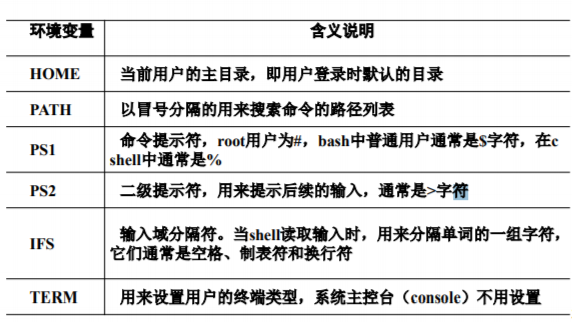

# Shell编程（1）

## Shell简介

在Linux操作系统中，shell是用户与操作系统内核打交道的接口

Linux中的shell有多种类型，最常用的几种是Bourne shell（sh）、C shell（csh）和Korn shell（ksh）

### Bourne shell（sh）

Bourne shell是UNIX最初使用的shell，并且在每种UNIX上都可以使用

Bourne shell在shell编程方面相当优秀，但在处理与用户的交互方面做得不如其他几种shell。 

Linux操作系统缺省的shell是bash，与Bourne shell全向后兼容，并且在Bourne shell的基础上增加、增强了很多特性。在Linux系统下面，sh是bash的符号链接

### C shell (csh)

Bill Joy于20世纪80年代早期，在Berkeley的加利福尼亚大学开发了C shell，它主要是为了让用户更容易的使用交互式功能，它的语法与C语言很相似。Linux为喜欢使用C shell的人提供了Tcsh。 Tcsh是C shell的一个扩展版本。Tcsh包括命令行编辑、可编程单词补全、拼写校正、历史命令替换、作业控制等。

### Korn shell（ksh）

AT&T的bell实验室David Korn开发了Korn shell。ksh结合了所有的C shell的交互式特性，并融入了Bourne shell的语法。Linux系统提供了pdksh（ksh的扩展），它支持任务控制，可以在命令行上挂起、后台执行、唤醒或终止程序。

## Shell基础

### Shell执行过程


### 标准输入/输出和重定向

#### 标准输入/输出


#### 重定向

##### 输入重定向的一般形式为：

command [参数] < 文件名

```shell
wc < /etc/passwd
```


##### 输出重定向的一般形式为：

如果文件已存在，会将原来的文件内容覆盖

command [参数] > 文件名

```shell
ls > ls.out
```


##### 输出重定向追加

不会覆盖原来文件的内容，而是追加到文件的尾部

command [参数] >> 文件名

```shell
ls >> ls.out
```

command [选项] 2> 错误文件名 （2和>之间没有空格）

command [选项] 2>> 错误文件名 （2和>>之间没有空格）

```shell
ls /usr/tmp 2> err.file
```

##### 避免文件重写

Shell提供了一种称为noclobber的功能，该功能可防止重定向时不经意地重写了已存在的文件。

### 管道

Shell使用管道将一个命令的输出直接作为另一个命令的输入

通过使用管道符“|”来建立一个管道，语法格式为：

```shell
command_a [参数] | command_b [参数]
```

这里需要注意，command_a 必须有正确输出，而 command_b 必须可以处理 command_a 的输出结果；而且只能处理 command_a 的正确输出结果，不能处理错误信息。

### 特殊字符

#### 通配符

通配符用于模式匹配，如文件名匹配、路径名搜索、字符串 查找等。常用的通配符有*、?和括在方括号［］中的字符序列

1. \*代表任何字符串（包括0个）。例如：“f*”匹配以f打 头的任意字符串
2. ?代表任何单个字符
3. ［］代表指定的一个字符范围，只要文件名中［］位 置处的字符在［］中指定的范围之内，那么这个文件名就 与这个模式串匹配

#### 引号

单引号

由单引号括起来的字符都作为普通字符出现。特殊字符用单引 号括起来以后也会失去原有意义，而只作为普通字符解释

```shell
string = '$PATH'
```

```shell
echo $string
```

双引号

由双引号括起来的字符，除“$”、“\”、“’”、和 “””这几个字符仍是特殊字符并保留其特殊功能外，其 余字符作为普通字符对待

```shell
string = "$PATH"
```

```shell
echo $string
```

反引号

反引号（`）括起来的字符串被shell解释为命令，在执行时 ，shell首先执行该命令，并以它的标准输出结果取代整个 反引号（包括两个反引号）部分

```shell
pwd
```

```shell
string = "current directory is `pwd`"
```

```shell
echo $string
```

#### 注释符

在shell编程中经常要对某些正文行进行注释，以增加程序的可读 性。在Shell中以字符“#”开头的正文行表示注释行

### 别名

命令别名通常是其他命令缩写，用来减少键盘输入。命令格式为

```shell
alias alias-name =’original-command’
```

示例

```shell
alias cdir = 'cd /home/user'
```

```shell
cdir
```

```shell
pwd
```

如果想取消别名，在bash提示符下键入如下命令

```shell
unalias cdir
```

不加参数的alias命令执行结果将显示当前系统中定义的所有命令别名

### 命令历史

Linux系统的bash提供了命令历史 的功能，通过history命令可以对当 前系统中执行过的所有shell命令进 行显示

若想重复执行命令历史中指定的命令，可使用如下格式

```shell
!命令编号
```

环境变量HISTSIZE的值保存历史命令记录的总行数， 该值的范围正常情况下是100~1000，当从shell中退出 时，最近执行的命令将保存在HISTFILE变量指定的文 件中

```shell
echo $HISTSIZE
```

环境变量HISTFILE指定存放命令历史的文件名称

```shell
echo $HISTFILE
```

HISTSIZE和HISTFILESIZE的区别

- HISTFILESIZE 定义了在 .bash_history 中保存命令的 记录总数
- HISTSIZE 定义了 history 命令输出的记录数

## Shell脚本

### 什么是Shell脚本

Shell脚本是用shell命令编写的文件，也称为shell script

与结构化程序不同，shell不需要编译成目标程序，也不需要 链接成可执行的目标码，shell是按行一条接着一条地解释并 执行shell脚本中的命令

### Shell脚本执行方式

有3种方式可以执行

1. 为脚本文件加上可执行权限，然后在命令行直接输入 shell脚本文件名执行
2. sh shell脚本名
3. . shell脚本名

例子：编写脚本pwd_script:

```shell
#! /bin/bash
#this script is to test shell running
date
cd /home/user
echo "The working directory is:"
pwd
#end
```

使用三种执行方式执行

## Shell变量

在shell脚本中也可以使用变量，一个变量就是内存中被命 名的一块存储空间

一个Shell变量的名字可以包含数字，字母和下划线，变量 名的开头只准许是字母和下划线。变量名中的字母是大小 写敏感的

变量名在理论上的长度没有限制

在shell编程中可以使用四种变量：用户自定义变量、环境 变量、位置变量和特殊变量

### 用户自定义变量

用户自定义变量的格式

```shell
Variable-name=value
```

注意：如果字符串里包含空格，就必须用引号把它们括起来 。还要注意在等号两边不能有空格

无论何时想要获取变量内容，必须在它前面加$字符

```shell
var=hello
```

```shell
echo $var
```

```shell
var="hello world"
```

```shell
echo $var
```

```shell
var=1+2
```

```shell
echo $var
```

清除变量

设置的变量不需要时可以清除，清除变量格式如下

```shell
unset variable-name
```

```shell
unset var
```

```shell
echo $var
```

### 环境变量

当一个shell脚本程序开始执行时，一些变量会根据环境设置 中的值进行初始化，这就是环境变量

它决定了用户的工作环境，通常用大写字母作为变量名，以 便把它们和用户在脚本程序里定义的变量区分开来

环境变量的值在系统的配置文件中设置，用户可对其进行修 改

#### 常用环境变量



查看环境变量

```shell
env
```

### 位置变量

如果脚本程序在执行时带有参数，就会创建一些额外的变量，这些 额外的变量因跟变量所在命令行位置有关，因此被称为位置变量或 位置参数

shell提供的位置变量有$0、$1、$2、$3、$4、$5、$6、$7、$8、 $9

这10个位置变量在shell脚本执行时用于存放shell脚本名及参数。 其中位置变量$0存放脚本名，$1、$2、$3、$4、$5、$6、$7、$8 、$9存放从左至右的命令行上的参数

当命令行上命令参数超过9个时，shell提供了shift命令可以把所有参数变量左移一个位置，使$2变成$1，$3变成$2，依此类推

```shell
shift [n]
```

其中n表示向左移动参数的个数，默认值为1

例子

```shell
# !/bin/bash
#This script test shift
echo $0
echo $1,$2,$3,$4,$5,$6,$7,$8,$9
shift
echo $1,$2,$3,$4,$5,$6,$7,$8,$9
shift
echo $1,$2,$3,$4,$5,$6,$7,$8,$9
shift 2
echo $1,$2,$4,$5,$6,$7,$8,$9
#scri3,$4,$5,$6,$7,$8,$9
shift 2
echo $1,$2,$3,$pt end
```

### 特殊变量

shell中有一些变量是系统定义的，有特殊的含义，变量 值由系统指定，被称之为特殊变量

- $#：表示传递给脚本的实际参数个数
- $$：当前shell脚本的进程号
- $*：位置参数的值，各个参数之间用环境变量IFS中定义的字 符分隔开
- $@：也表示位置参数的值，它不使用IFS环境变量，所以当 IFS为空时，参数值不会结合在一起
- $!：上一个后台命令的进程号
- $?：执行最后一条命令的退出状态

例子

```shell
# !/bin/bash
#This script test special variable
echo "the script name is :$0"
echo "the total arguments number is :$#"
echo "the arguments are $@"
echo "the arguments are $*"
echo '$$' is $$
echo "end"
```

