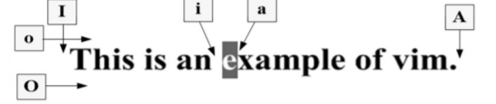

# Vim编辑器

## Vim简介

vi属于全屏幕编辑器，是Linux系统的第一个全屏幕交互式的编辑程序。

现在版本的Linux系统中运行的vi实际是vim（Vi Improved），它在vi的基础上增加了很多新的特性和功能。

vim编辑器不是一个格式化文本的程序，它不能调整版面，也不具有复杂的文字处理系统所具有的格式化输出功能。

## Vim工作模式

没有菜单，只有命令

- 命令模式(Command Mode)
- 插入模式(Insert Mode)
- 末行模式(Last Line Mode)

在输入vim的命令时，请注意区分大小写


## Vim进入和退出

### 进入

- vim
- vim 文件名
- vim +n 文件名
- vim +/匹配文件名


### 退出

1. 命令模式下

   - 在该模式下，连续按两下大写字母Z

     若当前文件被修改过，则vim保存该文件后退出，返回到shell

     若当前编辑的文件未被修改，则vim直接退出，返回到shell

2. 末行模式下

   1. 若当前文件被修改过，保存后退出

      ```bash
      : w <newfile>
      : q
      ```

   2. 如果当前编辑的内容保存到原文件退出，也可以使用如下命令

      ```bash
      : wq
      ```

   3. 若当前文件被修改过，不保存退出到shell

      ```bash
      : q!
      ```

   4. 若当前文件没有被修改过，从vim退出返回到shell

      ```bash
      :q
      ```

## Vim编辑命令

### 移动光标

1. 按字符移动光标

   1. h←
   2. j↓
   3. k↑
   4. l→

2. 按字移动光标

   B treats punctuation as part of the word, using only whitespace as word delimiters; b does not treat punctuation as part of the word.

   1. b
   2. B
   3. w
   4. W

3. 按句子和段移动光标

   1. {}段
   2. ()句子

4. 按行移动光标

   1. 数字0，可将光标移动到当前行行首。

   2. $键，将光标移到当前行行尾。

   3. G键将光标移到文件最末行行首，若将光标移动到指定行，可使用

      ```bash
      [行号]G
      ```

5. 在屏幕内移动光标

   1. H（Home）键将光标定位到屏幕顶部一行的最左端；
   2. M（Middle）键将光标定位到屏幕的中间一行；
   3. L（Lower）键将光标定位到屏幕底部的一行。
   4. 注意，这里的移动是指屏幕内，文件本身不发生滚动。

### 文本插入

1. 插入命令(Insert)
   1. i命令：从光标所在位置前插入文本
   2. I命令：将光标移动到当前行首开始插入文本
2. 附加命令(Append)
   1. a命令：从光标所在位置后开始追加文本
   2. A命令：首先将光标移到所在行的行尾，从行尾开始插入文本
3. 打开命令(Open)
   1. o命令：在当前行的上面打开一行
   2. O命令：在当前行的下面打开一行



### 文本删除

- 命令模式删除
- 末行模式删除


在vim末行模式下可实现对文本指定行的删除

- ```bash
  : 行x, 行y d
  ```

- 该命令表示删除x至y行的文本内容，例如

  - ```bash
    : 1, 5 d
    ```

- 对行号进行显示

  - ```bash
    : set number
    ```

### 文本的复制与粘贴

1. 命令模式下

   - yw：将光标所在位置到字尾的字符复制到缓冲区。
   - nyw：将从光标所在位置开始的n个字复制到缓冲区。
   - yy：将光标所在的行复制到缓冲区。
   - nyy：将光标所在的行开始连续n行复制到缓冲区。
   - p：将缓冲区的字符粘贴到光标所在位置。

2. 末行模式下

   - ```
     : 行x, 行y co 行z
     ```

     即将文本x-y行的内容，复制到z行下，例如

     ```bash
     : 1, 4 co 5
     ```

     当前编辑的文件1-4行复制到5行下，即原来文件内容新增了4行

### 文本移动

1. 命令模式下

   - 使用文本删除命令将要移动的文本删除
   - 使用光标移动命令将光标移动到目标位置
   - 使用p命令将刚刚删除的文本粘贴在目标位置

2. 末行模式下

   - ```
     : 行x, 行y m 行z
     ```

   - 该命令表示当前编辑的文件x-y行的文本内容移动到z行下。例如：

   - ```
     : 1, 4 m 6
     ```

   - 当前编辑的文本1-4行移动到6行下

### 文本的查找与替换

1. 命令模式下
2. 末行模式下

### 重复与取消

1. 重复命令
   1. 在命令模式下按"."键即可实现。
2. 取消命令
   1. 取消命令，也称为复原命令，它可以取消前一次的误操作。在命令模式下，使用u命令即可实现。

### Vim中执行shell命令

```bash
: sh
```

```bash
: ! command
```

### 文件的读写

```bash
: [address] r [filename]
```

```bash
: [address] w [filename]
```

```bash
: [address] w >> [filename]
```

## Vim创建Shell脚本

vim可以用来编辑shell脚本程序，与普通文本相同。

## Vim创建C程序

vim创建c程序的源文件，创建过程与普通的文本编辑过程一样，不同的是，编辑的内容是符合c语法的程序。