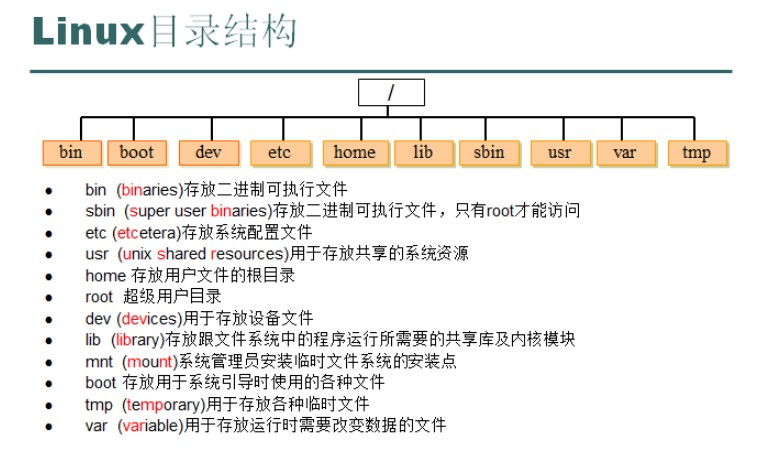
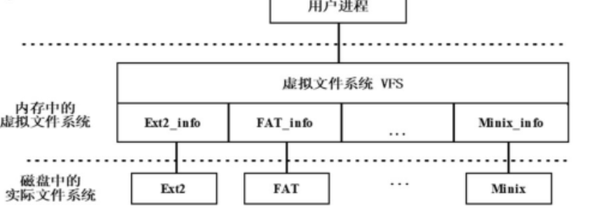

# Linux文件系统及命令

## Linux文件系统概述

特点：

1. Linux文件系统采用的是树形结构，从根目录root(/)开始
2. Linux的虚拟文件系统允许众多不同类型的文件系统共存，并支持跨文件系统的操作
3. Linux的文件是无结构字符流式文件，不考虑文件内部的逻辑结构，只把文件简单地看作是一系列字符的序列
4. Linux的文件可由文件拥有者或超级用户设置相应的访问权限而受到保护
5. Linux把所有的外部设备都看作文件，可以使用与文件系统相同的系统调用和函数来读写外部设备

## Linux文件系统组成



Linux中最常使用的EXT文件系统

不同版本的Linux系统所支持的文件系统类型和种类都会有所不同。采用下列命令查看当前Linux系统支持的文件系统。

```bash
cat /proc/filesystems
```

/proc: 虚拟目录，是系统内存的映射，可直接访问这个目录来获取系统信息

#### 其他文件系统

Linux允许众多不同类型的文件系统共存，并支持跨文件系统的操作，这是由于虚拟文件系统（Virtual File System，简称VFS）的存在

- 虚拟文件系统是Linux内核中的一个软件层，用于给用户空间的程序提供文件系统接口

- 它也提供内核中的一个抽象功能，允许不同的文件系统共存

- 系统中所有的文件系统不但依赖VFS共存，也依靠VFS协同工作

  

## Linux文件系统操作

#### 文件和目录的基本概念

文件是指由创建者定义的，具有文件名的一组相关元素的集合，文件可以是文本文档、图片、程序等

Linux系统下的文件名长度根据不同类型的文件系统有所不同，最多可到255个字符。Linux下为文件取名必须遵守以下规则：

1. 除了"/"外，所有的字符都可以使用
2. 转义字符最好不用，这些字符在Linux系统下有特定的含义，如"?"，"#"等
3. 避免使用"+"、"-"或"."作为普通文件名的第一个字符（在Linux下以"."开头的文件是隐藏文件）
4. Linux系统的文件名大小写敏感，文件Neko和文件neko是两个不同的文件

#### 通配符

- *通配符,代表任意字符(0到多个)
- ?通配符,代表一个字符
- []中间为字符组合
- ''又叫硬转义，其内部所有的shell 元字符、通配符都会被关掉。注意，硬转义中不允许出现'(单引号)。
- ...

##### 例子

1. ls test* *表示后面不论接几个字符都接受（没有字
   符也接受）
2. ls test? ?表示后面当且仅当接一个字符时才接受
3. ls test??? ???表示一定要接三个字符
4. cp test[1~5] /tmp test1, test2, test3, test4, test5若存在，则复制到/tmp目录下
5. cd /lib/modules/' uname -r'/kernel/drivers
   被 ' ' 括起来的命令先执行

Linux操作系统支持多种文件类型，常见的有普通文件、目录文件、
设备文件、链接文件几种。

1. 普通文件

   普通文件也称为常规文件，是Linux中最一般格式的文件，包括系统文件、用户文件和库函数。

2. 目录文件

   目录文件是由文件目录信息构成的特殊文件，目录文件的内容不是应用程序和数据，而是用来检索普通文件的目录信息。

3. 设备文件

   在Linux中输入输出设备被看做特殊文件，称为设备文件。设备文件分两类，字符设备文件和块设备文件。

   设备文件存放在Linux的/dev目录

   ```bash
   ls -la /dev/tty
   ```

   ```bash
   ls -la /dev/sda1
   ```

   其中/dev/tty是表示终端设备的文件
   字符串“crw-rw-rw-”的第一个字符c表示是字符设备文件
   /dev/sda1表示USB移动存储设备的文件
   字符串“brw-rw----”的第一个字符是b，表示是块设备文件

   块设备是以固定大小长度来传送转移资料，字符设备是以不定长度的字元传送资料。且所连接的设备也有所不同。

   块设备大致是可以随机存取资料的设备，如硬盘；而字符设备刚好相反，依循先後顺序存取资料的设备，如 激光打印机、电脑显示器等皆是。

4. 符号链接文件

   符号链接文件是一种特殊类型的文件，它的内容只是一个字符串，该字符串可能指向一个存在的文件也可能什么都不指向。

5. 套接字文件

6. 命名管道设备文件

[参考](https://www.cnblogs.com/f-ck-need-u/p/10430642.html)

#### 目录

目录是Linux文件系统中的一种特殊文件，文件系统利用目录完成按名存取及对文件信息的共享和保护

- 工作目录与用户主目录

  - 工作目录

    工作目录是用户在登录到Linux系统后所处于的目录，也称为当前目录。

  - 用户主目录

    是系统管理员增加用户时创建的（以后也可以改变），每个用户都有自己的主目录。普通用户的主目录在/home下，root用户作为系统管理员，因为身份特殊所以有自己的主目录，在/root下。
    用户刚登录到系统中时，其工作目录便是该用户主目录，通常与用户的登录名相同。如用户的登录名为user，其主目录通常为/home/user。

- 路径

  - 路径定义

    路径是指从树型目录中的某个目录层次到某个文件的一条道路。

  - 路径的构成要素

    路径是由目录或目录和文件名构成的，中间用"/"分开。

    ##### 绝对路径

    Linux系统中，绝对路径是从"/"（根目录）开始的，也称为完全路
    径，如/home/user01、/usr/bin。

    ##### 相对路径

    Linux系统中，相对路径是从用户工作目录或用户主目录开始的路径，如./test、../user1、\~/test。其中“.”表示用户工作目录，“..” 表示工作目录的上级目录，“~”表示用户主目录。

## 文件操作命令

### 显示文件

1. cat命令
2. more命令
3. less命令
4. head命令
5. tail命令

### 搜索、排序及去掉重复内容的命令

1. grep命令
2. sort命令
3. uniq命令

### 比较文件内容的命令

1. comm命令
2. diff命令