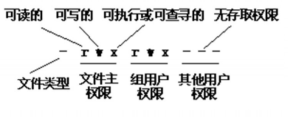
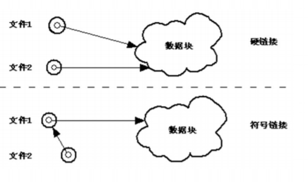

# Linux文件系统及命令

## 文件操作命令

### 复制、删除和移动文件的命令

1. cp命令
2. rm命令
3. mv命令

### 文件内容统计命令

wc命令

### 查找文件和目录命令

find命令

### 文件的压缩和备份

1. bzip2命令
2. gzip命令
3. tar命令

## 目录操作命令

### 切换工作目录和显示目录内容的命令

1. cd命令
2. pwd命令
3. ls命令

### 创建和删除目录命令

1. mkdir命令
2. rmdir命令

## 改变文件或目录存取权限命令

### 用户和用户组

Linux系统是一个多用户多任务的分时操作系统，任何一个要使用系统资源的用户，都必须首先向系统管理员申请一个账号，然后以这个账号的身份进入系统。 Linux内部用UID标识各用户。
用户组（group）就是具有相同特征的用户的集合体，Linux系统中每个用户都属于一个用户组，系统能对一个用户组中的所有用户进行集中管理。在Linux内部用户组用GID标识。
Linux系统规定了4种不同类型的用户，分别是文件主、同组用户、其他用户、超级用户。

### 存取权限

存取权限就是用来确定谁可以通过何种方式对文件和目录进行访
问，Linux系统规定3种访问文件和目录的方式。

1. 读（r）
   对文件表示只允许指定用户读取该文件的内容，禁止做任何更改操作；对目录表示可以列出存储在该目录下的文件。
2. 写（w）
   对文件表示允许指定用户打开并修改该文件；对目录表示允许从该目录中删除或添加新的文件。
3. 执行（x）
   对文件表示允许指定用户执行该文件；对目录表示允许在该目录中进行查找，能用cd命令将工作目录改为该目录。

用以下命令可以显示文件或目录的详细信息，其中第一字段即为 文件属性字段

```bash
ls -l
```



1. chmod命令
2. chgrp命令
3. chown命令

## 链接文件的命令

链接是一种在共享文件和访问它的用户的若干目录项之间建立联 系的一种方法。Linux系统下的链接有两种，硬链接（Hard Link），符号链接（Symbolic Link）。

1. 硬链接

   硬链接指通过索引节点来进行的链接。在Linux系统中，可以通过命令让多个文件名指向同一索引节点，这样一个文件就有不同的文件名。

   硬链接文件有两个限制：

   - 不允许给目录创建硬链接。
   - 只有在同一文件系统中的文件之间才能创建硬链接。

2. 符号链接

   符号链接又称软链接，软链接包含到另一个文件的路径名。

   软链接没有硬链接的限制，可以给目录创建链接，可以链接不同文件系统的文件。

   缺点：

   - 首先，因为链接文件包含有原文件的路径信息，所以当原文件从一个 目录移到其他目录时，再访问链接文件，系统找不到原文件，而硬链 接因索引节点会随着文件的移动做相应改变，所以不存在这个问题。
   - 其次，软链接文件还要系统分配额外的空间用于建立新的索引节点和 保存原文件的路径。



### ln命令

软链接与硬链接有如下几点区别： 

1. 硬链接的原文件和链接文件共用一个inode号，说明他们是同一个 文件；而软链接原文件和链接文件拥有不同的inode号表明他们是两个不 同的文件。
2. 硬链接在文件属性上体现不出来，其表示文件类型的字符处为“- ”，因为在本质上硬链接文件和原文件是完全平等关系，原文件是普通文 件，硬链接文件也是普通文件；而软链接明确标识是链接文件，其表示文 件类型的字符处为“l”。
3. 硬链接链接数目要增加，软链接的链接数目不会增加。
4. 硬链接文件大小跟原文件相同；软链接文件大小与原文件不同 
5. 硬链接有自己的文件名；软链接的文件名通常是指向其链接的原文 件。